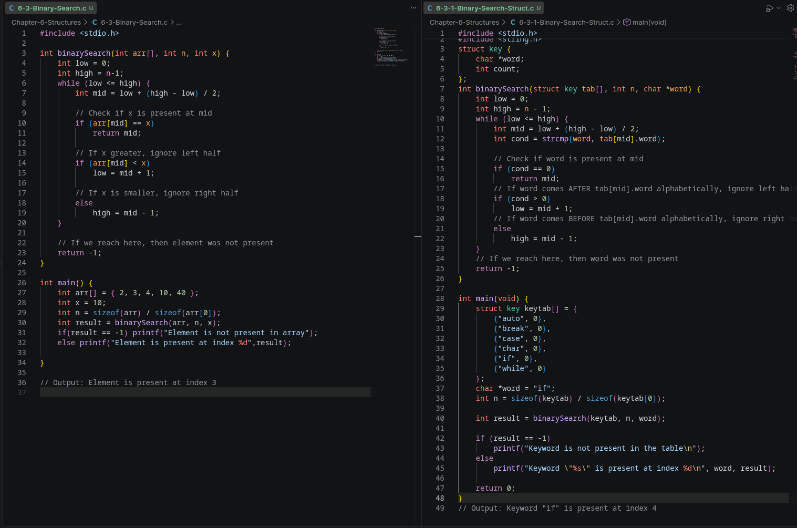

# Structures

I am hoping the `struct` concept is easier to wrap my head around than `pointer`. Pointer gave me PTSD and I still have difficulty sleeping at night. The only good thing came out of pointer, not for me but for my wife - I'm now afraid to point my finger at my her mistakes. I now point to a pointer of her mistake. Got it? Let's dive into `struct`.

## The Core Idea
A structure is a collection of one or more variables, possibly of different types, grouped together under a single name for convenient handling.

```c
// Structure Declaration (the template)
struct point {
    int x;
    int y;
};
```
* This defines the shape of a structure but creates no variable and allocates no memory - like designing a blank form.
```c
// Structure Variable Declaration (instantiation)
struct point origin;
```
* `struct point` acts as a type name (like `int`). This line actually creates a variable and allocates memory for it - like photocopying the blank form.

```c
// The Dot(.) operator - accessing members
origin.x=10;
origin.y=20;
```
* Reaches into a struct variable to read/write a specific member.
```c
// Initialization at Declaration
struct point pt={10,20};
```
* Creates and fills in a struct in one step. Values are matched in order to the members as declared.

```c
// Nested Structures
struct rect {
    struct point pt1;   // upper-left
    struct point pt2;   // lower-right
};
```
* A struct can contain other structs as members - building complex shapes from simpler ones.
```c
// Chained Dot Access
screen.pt2.y = 100;
```
## Structures and Functions

In this section, there are mainly three ideas that are introduced for passing the function arguments:
* pass the values
* pass the entire structure
* pass the pointer to a structure

Let's look at the legal operations first:

* copy it/assign it to another variable of the same type
    ```c
    struct point p1 = {10, 20};
    struct point p2;

    p2 = p1;        // legal: copies ALL members (x and y) from p1 into p2
    ```
    ```c
    if (p1 == p2)   // COMPILE ERROR - not allowed in C
    ```
* Taking the address of a struct

    Just like you can do &x for a plain int to get its memory address, you can do the exact same thing for a struct variable as a whole:

    ```c
    struct point origin = {10, 20};
    struct point *p;

    p = &origin;    // p now holds the memory address of origin
    ```

* `(*p).x` and `p->x`
    ```c
    (*p).x   // dereference p first, then access x - the parens are required
    p->x     // the shorthand arrow operator - cleaner, does the same thing
    ```
    Let's look at what it means with an example:
    ```c
    struct point {
        int x;
        int y;
    };

    struct point origin = {10, 20};
    struct point *p = &origin;   // p points to origin
    ```

    ***Method 1: `(*p).x`***
    ```c
    (*p).x = 100;   // step 1: *p means "the struct origin"
                    // step 2: .x means "its x member"
                    // net effect: origin.x = 100
    ```
    > Note: `*p.x` breaks because `.` operator has higher precedence that the `*` (dereference) operator so it means `*(p.x)` which means take p and access it's .x member and then dereference the result - compile error

    ***Method 2 : `p->x` (the arrow operator)***

    C recognized that (*p).x is clunky and error-prone (easy to forget the parens), so it provides -> as a single operator that does both steps at once:
    ```c
    p->x = 100;   // identical result to (*p).x = 100
    ```

### 1. Passing Structs to Functions
```c
int ptinrect(struct point p, struct rect r) {
    return p.x >= r.pt1.x && p.x < r.pt2.x
        && p.y >= r.pt1.y && p.y < r.pt2.y;
}
```
* Structs are passed by value (a full copy)
* Modifying p or r inside the function never affects the caller's originals.

### 2. Returning Structs - Composability
```c
struct point addpoint(struct point p1, struct point p2) {
    p1.x += p2.x;
    p1.y += p2.y;
    return p1;   // returns the modified copy - caller's originals untouched
}
```
### 3. Pointers to Structs - Avoiding Expensive Copies
```c
int ptinrect(struct point p, struct rect *rp) {
    return p.x >= rp->pt1.x && p.x < rp->pt2.x
        && p.y >= rp->pt1.y && p.y < rp->pt2.y;
}
```
* Passing large structs by value copies lots of bytes. A pointer avoids this - only the address is copied.

## Arrays of Structures

Let's look at what we have already established first.
* A struct groups different pieces of data together 
    ```c
    struct point { int x; int y; };
    struct point p = {10, 20};   // ONE point
    ```
* An array holds many values of the same tupes side by side (From Chapter- Pointer)
    ```c
    int scores[3] = {90, 85, 95};   // THREE ints, side by side
    ```
So `Arrays of Structures` just combines these two ideas: instead of an array holding plain ints side-by-side, it holds multiple structs side-by-side.
```c
struct point points[3] = { {0,0}, {5,5}, {10,10} };
//    ^this array holds THREE struct point values
```

Now lets look at K&R's example:
```c
struct key {
    char *word;    // the keyword text, e.g. "if"
    int count;     // how many times it's been seen
};

struct key keytab[] = {
    {"auto", 0},
    {"break", 0},
    {"case", 0},
    {"char", 0},
    {"if", 0},
    {"while", 0}
    /* ... and so on for every C keyword ... */
};

#define NKEYS (sizeof(keytab) / sizeof(keytab[0]))
```
```c
if (strcmp(keytab[2].word, "case") == 0) {
    printf("Match!\n");
}
```
Here is another example from K&R about binary search but for the array of structs:

What is [binary search](https://www.geeksforgeeks.org/dsa/binary-search/)?




## Pointers to Structures
