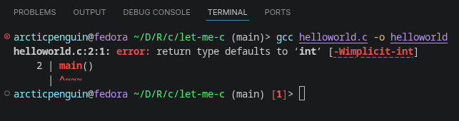
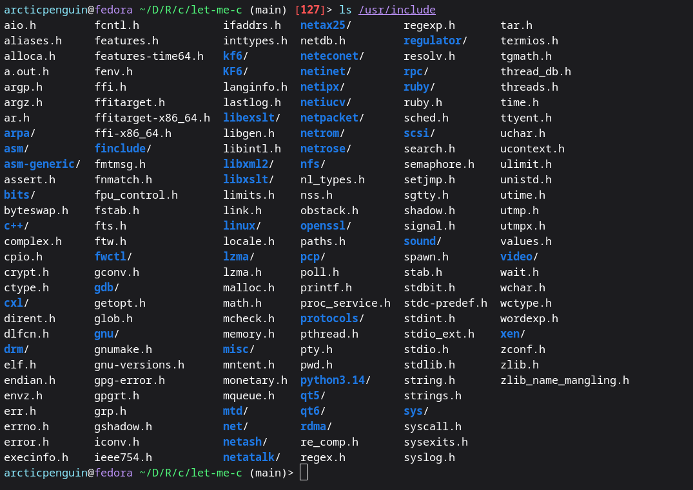
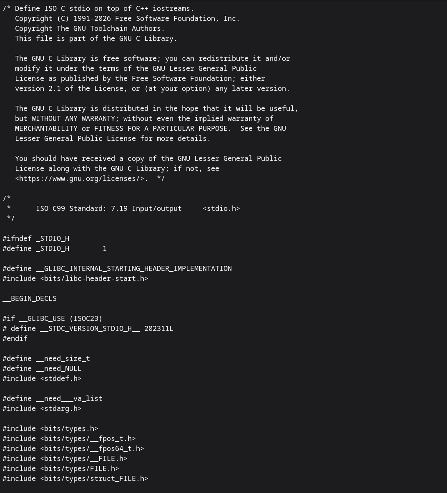
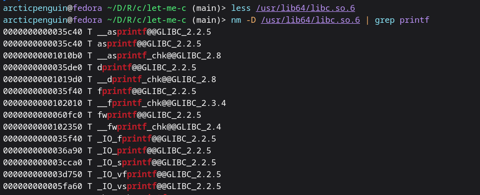

# Let me C

I am reading the book The C Programming Language, 2nd Edition by K&R. As I was going through the preface of the book, I liked this sentence and want to quote it: 'C wears well as one's experience with it grows.' I had experience with C during my Uni days while I was pursuing my electrical engineering degree. I didn't realize its importance at that point, but I am now realizing the depth of its presence. I am starting fresh from zero - let's C how far I can C.

```c
#include <stdio.h>
main()
{
    printf("Hello World\n");
}
````
To compile and run the script

```bash
$gcc helloworld.c -o helloworld && ./helloworld
```
As soon as I compiled it, it threw an error.



It turns out older C standards (K&R C /C89) allowed implicit init, meaning a function with no return type was assumed to return init. GCC now warns about this(and newer standards like C99/C11 removed it entirely).

```bash
$gcc -std=c89 helloworld.c -o helloworld
```
Choosing the C89 standard allowed me to run the code. But the right fix is adding init and it is the correct modern way.

```c
#include <stdio.h>
int main()  // ✅
{
    printf("Hello, World!\n");
    return 0;
}
```
OR
```c
#include <stdio.h>
int main(void)
{
    printf("Hello, World!\n");
    return 0;
}
```


## Under the hood

There are three layers to it:

```bash
─────────────────────────────────────────
  YOUR CODE  (helloworld.c)
  #include <stdio.h>
─────────────────────────────────────────
        │ uses declarations from
        ▼
─────────────────────────────────────────
  HEADER FILES  (/usr/include/stdio.h)
  Just function signatures & macros
  Written by glibc developers
─────────────────────────────────────────
        │ actual code lives in
        ▼
─────────────────────────────────────────
  GLIBC  (/usr/lib64/libc.so.6)
  The real compiled implementation
  of printf, scanf, malloc, etc.
─────────────────────────────────────────
        │ talks to
        ▼
─────────────────────────────────────────
  LINUX KERNEL
  Does the real I/O, memory, etc.
─────────────────────────────────────────
```

***The C Standard Library***

It is a collection of pre-written functions that come bundled with your C compiler. Instead of writing everything from scratch, you can use these ready-made functions for common tasks like input/output, math, string manipulation, memory management, etc.

> #include is a preprocessor directive- it tells compiler -"before compiling, copy the content of this file into my code"




Here is a snippet of the `stdio.h` file:


***glibc = GNU C Library***

It is the actual implementation of the C standard library made by the GNU project. It's the engine behind all those functions you use.



> What is a symbol table? - When C source code gets compiled into a binary (.so file), the human-readable function names don't disappear completely — they leave behind symbols so the system can find and link them at runtime.

What we are seeing is:
```bash
000000000001b110 T a64l
│                │  │
│                │  └── Function name (symbol)
│                └── Symbol type
└── Memory address (where it lives in the file)
```
When the program calls `printf`:
```bash
Our code says "call printf"
        │
        ▼
Linux loader opens /usr/lib64/libc.so.6
        │
        ▼
Looks up "printf" in the symbol table
        │
        ▼
Finds its memory address
        │
        ▼
Jumps to that address and executes the code
```

Now with this knowledge of how the code is complied and executed, lets dive into the book and try to follow the examples presented in the book and try to make sense of C.


## Chapter 1 : A Tutorial Introduction

### Example 1
```c
#include <stdio.h>

/*Implicit way*/
/*
main(){
    int c;
    c=getchar();
    while(c!=EOF){
        putchar(c);
        c=getchar();
    }
}
*/

/*Explict Way*/

main(){
    int c;
    int result;
    while ((c=getchar()) != EOF){
        result=(c!=EOF);
        putchar(c);
        printf("The value of while statement is %d\n", result);
    }
    result=(c!=EOF);
    printf("The value of while statement is now %d\n", result);
    
}
```
* EOF- end of file- its value is defined as -1 in <stdio.h>

* `getchar()` -> Reads one character at a time from the input stream and returns it as an int. Returns EOF when input is exhausted. Always store into int, never char, to safely handle EOF.

* `putchar()` -> Writes one character at a time to the output stream. Takes an int, prints it as a character.

>Key Rules
* Every getchar() call consumes one character — permanently. Calling it twice per loop eats characters silently.

* Enter (\n) is just a regular character — not EOF.

* EOF is a condition, not a character — triggered by Ctrl+D on Linux/Mac or end of a piped input.

* The idiomatic form while ((c = getchar()) != EOF) is preferred — one getchar(), no duplication, no bugs.

### Example 2
```c
#include <stdio.h>
int main(){
    long character_count;
    while(getchar() !=EOF){
        ++character_count;
    }
    printf("The total characters in the file or input is %ld", character_count);
}
```
```bash
# Compile and Run
(main)> gcc 1-5-2-Character-Counting.c -o 1-5-2-Character-Counting 
(main)> ./1-5-2-Character-Counting

# Output
hello
world
The total characters in the file or input is 12⏎    
```
OR
```c
#include <stdio.h>
int main(){
    double character_count;
    for(character_count=0; getchar()!=EOF; ++character_count)
    ;
    printf(" The total character in the file or input is %.0f", character_count);
}
```
```bash
# Output

(main)> echo Hello\nWorld| ./1-5-2-Character-Counting
 The total character in the file or input is 12⏎    
 ```
 >Key Points

 * ++nc — increment operator, cleaner shorthand for nc = nc + 1. Has a mirror --nc for decrementing.

* long type — used instead of int because input could exceed 32,767 characters (the max for a 16-bit int). Always use %ld with printf for long.

### Example 3 Array

The below code is available here as well [Array Example](https://github.com/satishkarki/let-me-c/blob/main/Chapter-1-A-Tutorial-Introduction/1-6-Arrays.c)


```c
int main()
{
    int c, i, nwhite, nother;
    int ndigit[10];

    nwhite = nother = 0;
    for (i = 0; i < 10; ++i)
        ndigit[i] = 0;

    while ((c = getchar()) != EOF)
        if (c >= '0' && c <= '9')
            ++ndigit[c-'0'];
        else if (c == ' ' || c == '\n' || c == '\t')
            ++nwhite;
        else
            ++nother;

    printf("digits =");
    for (i = 0; i < 10; ++i)
        printf(" %d", ndigit[i]);
    printf(", white space = %d, other = %d\n", nwhite, nother);
}
```

>key points


```c
int ndigit[10];
```
* Declares an array of 10 integers - one slot for each digit 0 through 9. Array indices always start at 0 in C.

```c
for (i = 0; i < 10; ++i)
    ndigit[i] = 0;
```
* Arrays are not automatically zero in C - you must initialize them manually.
* In C, always initialize your variables and arrays before using them. Never assume memory is clean.


```c
++ndigit[c - '0'];
```
* Since digit characters '0' through '9' have consecutive ASCII values (48–57), subtracting '0' gives you the actual numeric value

Here it is:

| `c` | ASCII value | `c - '0'` | Array slot |
|---|---|---|---|
| `'0'` | 48 | 0 | `ndigit[0]` |
| `'3'` | 51 | 3 | `ndigit[3]` |
| `'9'` | 57 | 9 | `ndigit[9]` |


With this in mind, we will look at arrays more in  `Character Array` topic, which is more interesting.

### Example 4 Function

```c
#include <stdio.h>
int power(int m, int n);  /* function prototype */

/* test power function */
int main()
{
    int i;
    for (i = 0; i < 10; ++i)
        printf("%d %d %d\n", i, power(2,i), power(-3,i));
    return 0;
}

/* power: raise base to n-th power; n >= 0 */
int power(int base, int n)
{
    int i, p;
    p = 1;
    for (i = 1; i <= n; ++i)
        p = p * base;
    return p;
}
```
> Key Points

* `int power(int m, int n);  /* declared BEFORE main */` tells the compiler what to expect before it sees the actual function definition
* `int power(int, int);  /* names omitted — still valid */` 


### Example 5 Character Arrays

Before diving into the details, let's look at how it is different from python.
```python
name="satish"
print(name) #just works
```
In C, printf has no idea where your string ends — it just walks memory until it hits '\0':
```c
char name[7] = "Satish";   // '\0' added automatically by the string literal
printf("%s", name);         // walks until '\0' — prints "Satish"

char name2[6] = {'S','a','t','i','s','h'};  // no '\0' !
printf("%s", name2);   // prints "Satish" then keeps going into garbage memory 
```
Now lets start with this basic example to have a foundational understanding of character array before moving on to the example of book.
```c
#include <stdio.h>
int main(){
    char word[10];
    int c, i;
    i=0;
    printf("Enter the word:");
    while((c=getchar())!='\n' && c!=EOF)
        word[i++]=c;
    word[i]='\0';
    printf("The word you entered is %s\n", word);
    printf("The length of the word is %d",i);
    return 0;
}
```
```bash
#Output

$ ./1-9-Character-Arrays-Foundation 
Enter the word:Satish
The word you entered is Satish
The length of the word is 6⏎    
```
> key points

* `word[i++]` is two operations in one:
    
    * word[i]=c -> store the character at current position 
    * `i++` -> then moves to the next slot
* The `++` is postfix -> it uses `i` first, then increments.
* The null terminator `word[i]='\0'`, without it `printf("%s", word)` would print the word and then keep reading garbage memory until it accidentally hits a zero byte somewhere.
* `word[10]` -> This array only has 10 slots (indices 0–9). If the user types more than 9 characters, i reaches 9 and you'd write word[10] — one past the end. This is called a buffer overflow — one of the most dangerous bugs in C. 


[Book Example](https://github.com/satishkarki/let-me-c/blob/main/Chapter-1-A-Tutorial-Introduction/1-9-Character-book-code.c)

K&R wrote this book in 1988. Back then getline didn't exist in the standard library. Modern Linux's <stdio.h> now has its own getline with a different signature. The compiler sees two different functions with the same name - and complains. So in example `getline[]` is replaced with `my_getline[]`.

Example Flow:

```bash
Input: "hi\nlongest line\nok\n"

Iteration 1: my_getline → "hi\n"        len=3  → max=3  → copy to longest
Iteration 2: my_getline → "longest\n"   len=9  → max=9  → copy to longest
Iteration 3: my_getline → "ok\n"        len=3  → 3<9    → skip
EOF:          my_getline → returns 0    → loop exits
                                        → print "longest line"
```

### Example 6 External Variable and Scope


