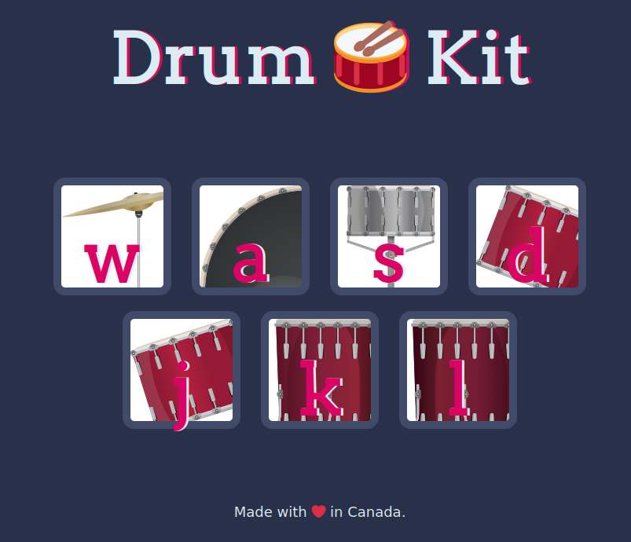

# Document Object Model

- When a web page is loaded, the browser creates a **D**ocument **O**bject **M**odel of the page
- The **HTML DOM** model is constructed as a tree of **Objects**
- With the object model, JavaScript gets all the power it needs to create  dynamic HTML
- The HTML DOM is a standard **object** model and  **programming interface** for HTML. It defines:
  - The HTML elements as **objects**  
  - The **properties** of all HTML elements  
  - The **methods** to access all HTML elements
  - The **events** for all HTML elements

- HTML DOM methods are **actions** you can perform (on HTML  Elements)
- HTML DOM properties are **values** (of HTML Elements) that you can  set or change

```html
<script>
document.getElementById("demo").innerHTML = "Hello World!";
</script>
```

In the example above, `getElementById` is a **method**, while `innerHTML` is a  **property**

## HTML DOM Methods

```javascript
document.getElementById("id");
document.getElementsByTagName("tag");
document.getElementsByClassName("class");
```

[Learn More](https://www.w3schools.com/js/js_htmldom_document.asp)

## HTML DOM Property

Text manipulation and text content property

- innerHTML
- textContent

HTML DOM Element Arribute

- getAttribute
- setAttribute

## Advanced JavaScript and DOM Manipulation

- [EventTarget.addEventListener()](https://developer.mozilla.org/en-US/docs/Web/API/EventTarget/addEventListener)

  - EventTarget: Creates a new `EventTarget` object instance

  - [Methods](https://developer.mozilla.org/en-US/docs/Web/API/EventTarget#methods)

    - [`EventTarget.addEventListener()`](https://developer.mozilla.org/en-US/docs/Web/API/EventTarget/addEventListener)

      Registers an event handler of a specific event type on the `EventTarget`.

    - [`EventTarget.removeEventListener()`](https://developer.mozilla.org/en-US/docs/Web/API/EventTarget/removeEventListener)

      Removes an event listener from the `EventTarget`.

    - [`EventTarget.dispatchEvent()`](https://developer.mozilla.org/en-US/docs/Web/API/EventTarget/dispatchEvent)

      Dispatches an event to this `EventTarget`.

```javascript
document.querySelector("button").addEventListener("click",handleEvent);
function handleEvent(){
    alert("I got clicked!");
}
```

```javascript
var totalButtons=document.querySelectorAll(".drum").length;
for (i=0; i<totalButtons; i++){
    document.querySelectorAll("button")[i].addEventListener("click",handleEvent);
    
}
function handleEvent(){
    alert("I got clicked!"); 
}
```

### Higher Order Functions

These are the functions that cab take other functions as inputs.

```javascript
function add(num1,num2){
  return num1+num2;
}
function multiply(num1,num2){
  return num1*num2;
}
function calculator(num1,num2,operator){
  return operator(num1,num2);
}
console.log(calculator(4,5,add));
console.log(calculator(4,5,multiply));
```

### Callback Function

```javascript
document.addEventListner("keypress", respondToKey(event));
function respondToKey(event){
	console.log("Key Pressed.");
}
//respondToKey is a callback function 


//Under the hood
function anotherAddEventListner(typeOfEvent, callback){
    //Detect Event Code
    var eventThatHappened={
        eventType:"keypress",
        key:"p",
        durationOfKeypress:2
    }
    if (eventThatHappened.eventType===typeOfEvent){
        callback(eventThatHappened);
    }
}
anotherAddEventListner("keypress", function(event){
    console.log(event);
}};
```


### Play Sound on a website

```javascript
var audio= new Audio("sounds/crash.mp3");
audio.play(); 
```

### [What is **this**?](https://www.w3schools.com/js/js_this.asp)

The JavaScript `this` keyword refers to the object it belongs  to. 

It has different values depending on where it is used:

- In a method, `this` refers to the **owner object**.
- Alone, `this` refers to the **global object**.
- In a function, `this` refers to the **global object**.
- In a function, in strict mode, `this` is `undefined`.
- In an event, `this` refers to the **element** that received the event.
- Methods like `call()`, and `apply()` can refer `this` to **any object**.

```javascript
//In this example, this represents the person object
const person = {
  firstName: "John",
  lastName: "Doe",
  id: 5566,
  fullName : function() {
    return this.firstName + " " + this.lastName;
  }
};
```

### [JavaScript Object](https://www.w3schools.com/js/js_objects.asp)

In real life, a car is an **object**.  A car has **properties** like weight and color, and **methods** like start and stop.

### [Constructor Function](https://www.w3schools.com/js/js_object_constructors.asp)

```javascript
function Person(first, last, age, eye) {
  this.firstName = first;
  this.lastName = last;
  this.age = age;
  this.eyeColor = eye;
}
```

- It is considered good practice to name constructor functions with an upper-case first letter

### Object Type

The value of `this`, when used in an object, is the object itself.

```javascript
const myFather = new Person("John", "Doe", 50, "blue");
const myMother = new Person("Sally", "Rally", 48, "green");
```

### Adding Animation

## DRUM ROLL CODE 

The drum sound will be played when we press the letter mentioned in the picture, or press the picture with mouse click

[Source Code](https://github.com/satishkarki/DrumRoll.git)



```javascript
//Detecting Button Pressed
var totalButtons=document.querySelectorAll(".drum").length;
for (var i=0; i<totalButtons; i++){
    document.querySelectorAll("button")[i].addEventListener("click",handleEvent);   
}
function handleEvent(){
        var buttonInnerHTML=this.innerHTML;
        makeSound(buttonInnerHTML);
        buttonAnimation(buttonInnerHTML);
        };

//Detecting Keyboard Press
document.addEventListener("keypress",function(event){
    makeSound(event.key);
    buttonAnimation(event.key);
});

function makeSound(key){
    switch (key){
        case "w":
            var crash= new Audio("sounds/crash.mp3");
            crash.play(); 
        break;
        case "a":
            var kick= new Audio("sounds/kick-bass.mp3");
            kick.play(); 
        break;
        case "s":
            var snare= new Audio("sounds/snare.mp3");
            snare.play(); 
        break;
        case "d":
            var tom1= new Audio("sounds/tom-1.mp3");
            tom1.play(); 
        break;
        case "j":
            var tom2= new Audio("sounds/tom-2.mp3");
            tom2.play(); 
        break;
        case "k":
            var tom3= new Audio("sounds/tom-3.mp3");
            tom3.play(); 
        break;
        case "l":
            var tom4= new Audio("sounds/tom-4.mp3");
            tom4.play(); 
        break;
        default:console.log(buttonInnerHTML);
    }};
// Animation of button
function buttonAnimation(currentKey){
    var activeButton=document.querySelector("."+currentKey);

    activeButton.classList.add("pressed");

    setTimeout(function(){
        activeButton.classList.remove("pressed");
    },100);
    };
```

