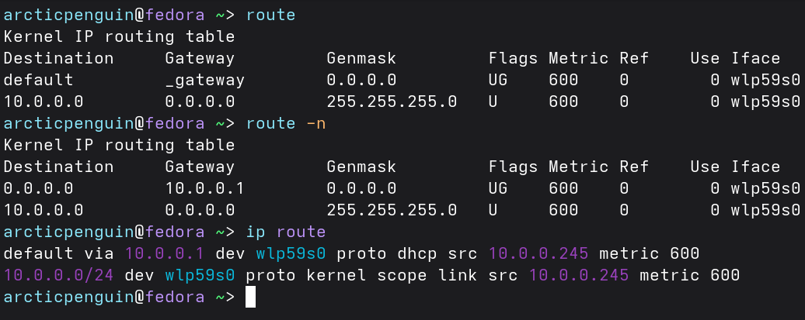
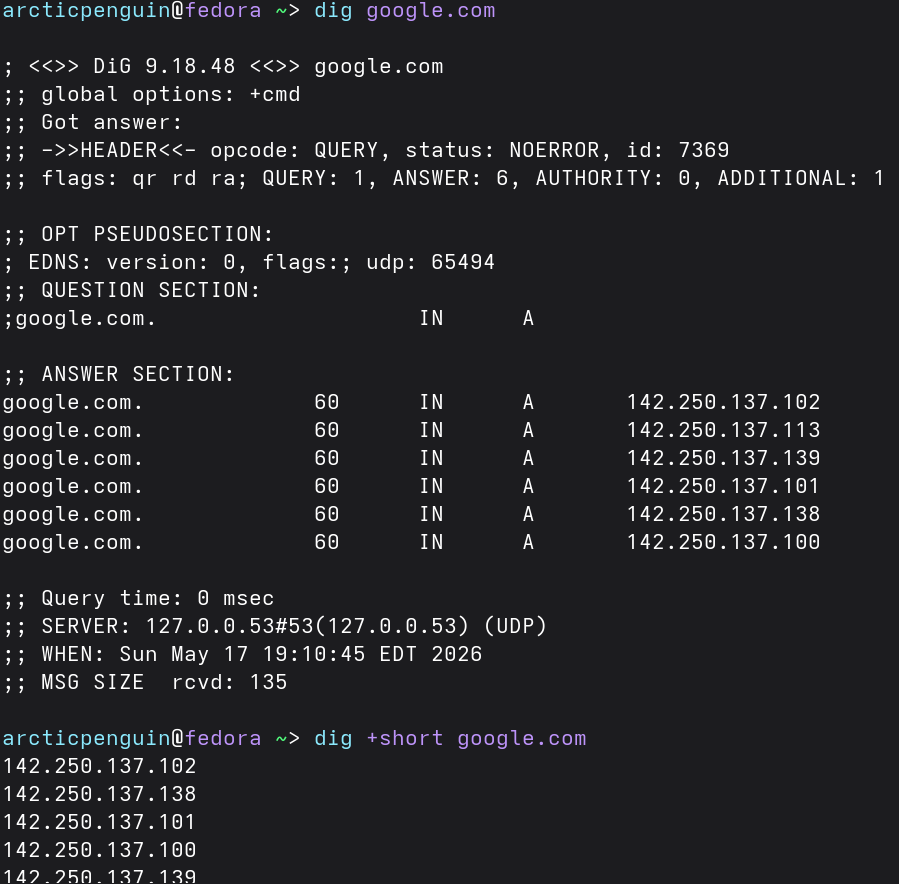
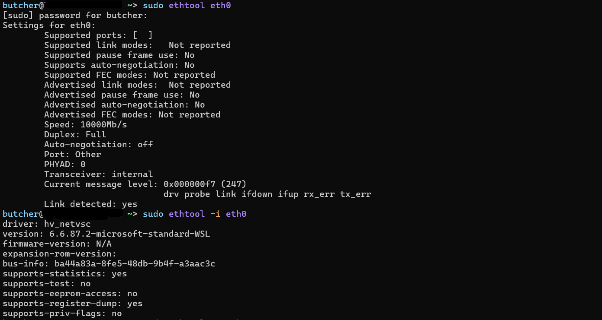

## Subnet - primer
An IPv4 address has two parts:
* Network portion — Identifies the subnet (like a street name)
* Host portion — Identifies the individual device (like a house number)

The subnet mask (or /prefix in CIDR) tells us where to split them.

***Example***

IP: 192.168.1.42/24

* /24 means first 24 bits = network portion → 192.168.1.0
* Last 8 bits = host portion → this device is host #42
* Full subnet: 192.168.1.0/24
* Total usable hosts in this subnet: 254 (from .1 to .254)

Special Addresses in Every Subnet:

* Network address: 192.168.1.0 (all host bits = 0) — identifies the subnet
* Broadcast address: 192.168.1.255 (all host bits = 1) — reaches every device on the subnet
* Usable hosts: 192.168.1.1 to 192.168.1.254 (254 devices)

How Many Hosts?

> Formula: 2^(32 - prefix) - 2

* /24 → 254 usable hosts
* /27 → 30 usable hosts
* /30 → 2 usable hosts (common for router links)

## Routes and Kernel Routing Table

A route is a rule that tells the kernel:

“For packets going to this destination (or range of destinations), send them via this gateway and/or this network interface.”
* If the destination IP is on the same subnet as one of your network interfaces → the kernel sends the packet directly to that device (using ARP to find the MAC address).
* If the destination IP is on a different subnet → the kernel must forward the packet to a router (also called a gateway). The router then decides the next hop.

***Commands***

```bash
$ route # Old deprecated but still works

$ route -n 

$ ip route # Modern Linux Commnd
```


***How the Kernel Uses the Table?***

> The Longest prefix Match

Example:

* Destination: 192.168.1.50 → matches the /24 route → send directly via enp0s3.
* Destination: 8.8.8.8 (Google DNS) → doesn’t match the /24 → falls back to the default route → send to 192.168.1.1


***Flags***

* U — Up: The route is active and usable.
* G — Gateway: This route uses a gateway (router). You will see this on the default route and any remote network routes.
* H — Host: This is a route to a single specific host (not a whole network). Rare on normal systems.
* D — Dynamically created (e.g., by routing daemon).
* R — Reinstate (restored after timeout).
* M — Modified (changed by routing daemon).

Common Combinations:

* U → Directly connected network (local subnet). No gateway needed.
* UG → Default route or remote network. Uses a gateway.
* UH → Route to a single specific host (e.g., a loopback or manually added host route).

## Basic ICMP and DNS tools

***1. ICMP*** (Internet Control Message Protocol) is a supporting protocol in the Internet Layer. It is used for error reporting, diagnostics, and simple queries. It does not carry user data like TCP or UDP.

The most common ICMP message type is Echo Request / Echo Reply — this is what `ping` uses.
```bash
ping 8.8.8.8          # Test connectivity to Google DNS by IP
ping google.com       # Test by hostname (uses DNS first)
ping -c 4 8.8.8.8     # Send only 4 packets and stop
```
***Alternative tools***

```bash
mtr google.com # MTR- My Traceroute
```
```bash
# fping 
fping -a -g 192.168.1.0/24 2>/dev/null # Scan a subnet: Shows only alive hosts, suppresses errors

fping -f hosts.txt # ping from a file

fping -s -c 5 192.168.1.1 # Send 5 pings and show stats
```
***2. DNS tool*** - the `host` command

```bash
host google.com
host 8.8.8.8                  # Reverse lookup (IP → name)
host -t MX google.com         # Query specific record type (MX = mail servers)
```
***Alternative tools***

```bash
dig google.com          # Full detailed output
dig +short google.com   # Short answer only
```


## Kernel Network Interface
The kernel network interface is the "door" the kernel uses to send and receive packets to/from the hardware. Each interface has a name (e.g., eth0, enp0s3, wlan0, docker0, lo for loopback).

1. The Old Tool: `ifconfig`

   ```bash
    ifconfig                  # Show only UP (active) interfaces
    ifconfig -a               # Show ALL interfaces (including down ones) 

    # Bringing interface up/down
    sudo ifconfig eth0 up
    sudo ifconfig eth0 down
    ```

2. Modern Replacement: `ip link` and `ip addr`
    ```bash
    ip link show              # Show interface status and link-layer info (like ifconfig -a)
    ip addr show              # Show IP addresses + interface status (most useful)
    ip addr show eth0         # Show only one interface

    # Bring interface up/down
    sudo ip link set eth0 up
    sudo ip link set eth0 down 
    ```
3. Low-Level Hardware Info - `ethtool`
    ```bash
    sudo ethtool eth0                  # Basic info: speed, duplex, link status
    sudo ethtool -i eth0               # Driver information (which kernel module is used)
    sudo ethtool -S eth0               # Detailed statistics (errors, drops, etc.)
    sudo ethtool -k eth0               # Show offload features (checksum offloading, etc.)
    ```
    

More about network manager [here](https://satishkarki.com/posts/Network-Manager-CLI/)

## Resolving hostnames

| Component          | Purpose                                              | Key File / Tool                          |
|--------------------|------------------------------------------------------|------------------------------------------|
| **/etc/hosts**     | Static local mappings (checked first)                | `/etc/hosts`                             |
| **DNS Servers**    | Remote lookup (real internet/hostnames)              | `/etc/resolv.conf`                       |
| **nsswitch**       | Controls lookup **order**                            | `/etc/nsswitch.conf`                     |
| **Local Resolver** | Caching, systemd-resolved, mDNS (.local names)       | `resolvectl`, `systemd-resolved`         |


***Resolving flow***
1. Type ping google.com
2. System checks /etc/hosts first
3. If not found → queries DNS servers listed in /etc/resolv.conf
4. Result is cached locally for speed

## The Transport Layer: TCP, UDP, and Services


