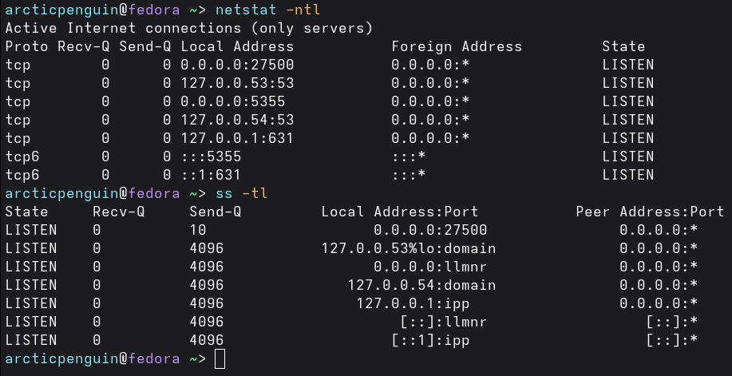

## Subnet - primer
An IPv4 address has two parts:
* Network portion — Identifies the subnet (like a street name)
* Host portion — Identifies the individual device (like a house number)

The subnet mask (or /prefix in CIDR) tells us where to split them.

***Example***

IP: 192.168.1.42/24

* /24 means first 24 bits = network portion → 192.168.1.0
* Last 8 bits = host portion → this device is host #42
* Full subnet: 192.168.1.0/24
* Total usable hosts in this subnet: 254 (from .1 to .254)

Special Addresses in Every Subnet:

* Network address: 192.168.1.0 (all host bits = 0) — identifies the subnet
* Broadcast address: 192.168.1.255 (all host bits = 1) — reaches every device on the subnet
* Usable hosts: 192.168.1.1 to 192.168.1.254 (254 devices)

How Many Hosts?

> Formula: 2^(32 - prefix) - 2

* /24 → 254 usable hosts
* /27 → 30 usable hosts
* /30 → 2 usable hosts (common for router links)

## Routes and Kernel Routing Table

A route is a rule that tells the kernel:

“For packets going to this destination (or range of destinations), send them via this gateway and/or this network interface.”
* If the destination IP is on the same subnet as one of your network interfaces → the kernel sends the packet directly to that device (using ARP to find the MAC address).
* If the destination IP is on a different subnet → the kernel must forward the packet to a router (also called a gateway). The router then decides the next hop.

***Commands***

```bash
$ route # Old deprecated but still works

$ route -n 

$ ip route # Modern Linux Commnd
```


***How the Kernel Uses the Table?***

> The Longest prefix Match

Example:

* Destination: 10.0.0.50 → matches the /24 route → send directly via wlp59s0.
* Destination: 8.8.8.8 (Google DNS) → doesn’t match the /24 → falls back to the default route → send to 10.0.0.1


***Flags***

* U — Up: The route is active and usable.
* G — Gateway: This route uses a gateway (router). You will see this on the default route and any remote network routes.
* H — Host: This is a route to a single specific host (not a whole network). Rare on normal systems.
* D — Dynamically created (e.g., by routing daemon).
* R — Reinstate (restored after timeout).
* M — Modified (changed by routing daemon).

Common Combinations:

* U → Directly connected network (local subnet). No gateway needed.
* UG → Default route or remote network. Uses a gateway.
* UH → Route to a single specific host (e.g., a loopback or manually added host route).

## Basic ICMP and DNS tools

***1. ICMP*** (Internet Control Message Protocol) is a supporting protocol in the Internet Layer. It is used for error reporting, diagnostics, and simple queries. It does not carry user data like TCP or UDP.

The most common ICMP message type is Echo Request / Echo Reply — this is what `ping` uses.
```bash
ping 8.8.8.8          # Test connectivity to Google DNS by IP
ping google.com       # Test by hostname (uses DNS first)
ping -c 4 8.8.8.8     # Send only 4 packets and stop
```
***Alternative tools***

```bash
mtr google.com # MTR- My Traceroute
```
```bash
# fping 
fping -a -g 192.168.1.0/24 2>/dev/null # Scan a subnet: Shows only alive hosts, suppresses errors

fping -f hosts.txt # ping from a file

fping -s -c 5 192.168.1.1 # Send 5 pings and show stats
```
***2. DNS tool*** - the `host` command

```bash
host google.com
host 8.8.8.8                  # Reverse lookup (IP → name)
host -t MX google.com         # Query specific record type (MX = mail servers)
```
***Alternative tools***

```bash
dig google.com          # Full detailed output
dig +short google.com   # Short answer only
```


## Kernel Network Interface
The kernel network interface is the "door" the kernel uses to send and receive packets to/from the hardware. Each interface has a name (e.g., eth0, enp0s3, wlan0, docker0, lo for loopback).

1. The Old Tool: `ifconfig`

   ```bash
    ifconfig                  # Show only UP (active) interfaces
    ifconfig -a               # Show ALL interfaces (including down ones) 

    # Bringing interface up/down
    sudo ifconfig eth0 up
    sudo ifconfig eth0 down
    ```

2. Modern Replacement: `ip link` and `ip addr`
    ```bash
    ip link show              # Show interface status and link-layer info (like ifconfig -a)
    ip addr show              # Show IP addresses + interface status (most useful)
    ip addr show eth0         # Show only one interface

    # Bring interface up/down
    sudo ip link set eth0 up
    sudo ip link set eth0 down 
    ```
3. Low-Level Hardware Info - `ethtool`
    ```bash
    sudo ethtool eth0                  # Basic info: speed, duplex, link status
    sudo ethtool -i eth0               # Driver information (which kernel module is used)
    sudo ethtool -S eth0               # Detailed statistics (errors, drops, etc.)
    sudo ethtool -k eth0               # Show offload features (checksum offloading, etc.)
    ```
    

More about network manager [here](https://satishkarki.com/posts/Network-Manager-CLI/)

## Resolving hostnames

| Component          | Purpose                                              | Key File / Tool                          |
|--------------------|------------------------------------------------------|------------------------------------------|
| **/etc/hosts**     | Static local mappings (checked first)                | `/etc/hosts`                             |
| **DNS Servers**    | Remote lookup (real internet/hostnames)              | `/etc/resolv.conf`                       |
| **nsswitch**       | Controls lookup **order**                            | `/etc/nsswitch.conf`                     |
| **Local Resolver** | Caching, systemd-resolved, mDNS (.local names)       | `resolvectl`, `systemd-resolved`         |


***Resolving flow***
1. Type ping google.com
2. System checks /etc/hosts first
3. If not found → queries DNS servers listed in /etc/resolv.conf
4. Result is cached locally for speed

## The Transport Layer: TCP, UDP, and Services

Let's look at port first. They are like apartment numbers in a building. The building is your computer (IP address), and each apartment is a different service waiting for visitors.

```bash
┌─────────────────────────────────────────────────────────────┐
│  PORT RANGES                                                │
│                                                             │
│  0 - 1023      ← Well-Known Ports (need root to use)        │
│                   SSH:22, HTTP:80, HTTPS:443, DNS:53        │
│                                                             │
│  1024 - 49151  ← Registered Ports                           │
│                   MySQL:3306, PostgreSQL:5432, Redis:6379   │
│                                                             │
│  49152 - 65535 ← Ephemeral/Dynamic Ports                    │
│                   Assigned automatically to clients         │
└─────────────────────────────────────────────────────────────┘
```
Now lets look at an overview of the TCP connection:

```bash
CLIENT                              SERVER
  │                                   │
  │──── SYN ─────────────────────────►│  "Hey, can you hear me?"
  │                                   │
  │◄─── SYN-ACK ──────────────────────│  "Yes! Can you hear ME?"
  │                                   │
  │──── ACK ─────────────────────────►│  "Yes! Let's talk."
  │                                   │
  │════════ DATA FLOWS ═══════════════│
  │                                   │
  │──── FIN ─────────────────────────►│  "I'm done talking."
  │◄─── FIN-ACK ──────────────────────│  "OK, goodbye."
```


 Now that we looked at port and TCP, here is how a unique connection works:
 ```bash
 Source IP : Source Port  →  Destination IP : Destination Port

Example:
192.168.1.5:54321  →  93.184.216.119:80

This is ONE unique connection.
 ```
This is why our computer can have thousands of simultaneous connections to the same website — each connection gets a different source port (ephemeral port).

```bash
Your Computer (192.168.1.5)
├── :54321 → google.com:80    (Tab 1)
├── :54322 → google.com:80    (Tab 2)
├── :54323 → google.com:80    (Tab 3)
└── :54324 → google.com:443   (Tab 4 - HTTPS)
```
***Examples and Commands***
1. Viewing Active Connections with netstat
    ```bash
    # Show all TCP connections
    netstat -nt

    # Show all listening ports
    netstat -ntl

    # Show both TCP and UDP
    netstat -ntul

    # Show with process names (need sudo for other users' processes)
    sudo netstat -ntulp
    ```
2. The modern replacement: ss (Socket Statistics)

    `ss` is faster and more powerful than `netstat`
    ```bash
    # Show all TCP connections
    ss -t

    # Show listening ports only
    ss -tl

    # Show with process info
    sudo ss -tlp

    # Show all states with more detail
    ss -tan

    # Show UDP
    ss -ul

    # Filter by port
    ss -t '( dport = :80 or sport = :80 )'

    # Filter by state
    ss -t state established
    ss -t state time-wait
    ss -t state listening
    ```
    


## Understanding DHCP

```bash
CLIENT                                    DHCP SERVER
  │                                            │
  │                                            │
  │  ①DISCOVER                                │
  │  "Is anyone out there?                     │
  │   I need an IP address!"                   │
  │  (broadcast to 255.255.255.255)            │
  │─────────────────────────────────────────►  │
  │                                            │
  │                          ②OFFER           │
  │                     "I'm here!             │
  │                      How about             │
  │                      192.168.1.45?"        │
  │◄─────────────────────────────────────────  │
  │                                            │
  │  ③REQUEST                                 │
  │  "Yes please! I'd like                     │
  │   192.168.1.45"                            │
  │  (still broadcast - others may have        │
  │   offered too)                             │
  │─────────────────────────────────────────►  │
  │                                            │
  │                          ④ACKNOWLEDGE     │
  │                     "It's yours!           │
  │                      Lease: 24 hours"      │
  │◄─────────────────────────────────────────  │
  │                                            │
  │  Device is now configured!                 │
  ```
  * DHCP uses UDP port 67 (server) and 68 (Client)- not TCP

What DHCP sends you ? - The Full Package
```bash
DHCP Lease Contains:
┌─────────────────────────────────────────────────────────┐
│  REQUIRED                                               │
│  ├── IP Address          (e.g., 192.168.1.45)           │
│  ├── Subnet Mask         (e.g., 255.255.255.0)          │
│  └── Lease Duration      (e.g., 86400 seconds)          │
│                                                         │
│  COMMON OPTIONAL                                        │
│  ├── Default Gateway     (e.g., 192.168.1.1)            │
│  ├── DNS Server(s)       (e.g., 8.8.8.8, 8.8.4.4)       │
│  ├── Domain Name         (e.g., home.local)             │
│  ├── NTP Server          (time server)                  │
│  └── TFTP Server         (for network booting)          │
│                                                         │
│  ADVANCED (enterprise)                                  │
│  ├── WINS Server         (Windows name resolution)      │
│  ├── Static Routes       (extra routing info)           │
│  └── Vendor Options      (custom data)                  │
└─────────────────────────────────────────────────────────┘
```

Setting up a Simple DHCP server on Linux
```bash
# Install ISC DHCP server
sudo apt install isc-dhcp-server      # Ubuntu/Debian
sudo dnf install dhcp-server          # Fedora/RHEL
```

Basic configuration `/etc/dhcp/dhcpd.conf`
```bash
# Global settings
default-lease-time 86400;        # 24 hours
max-lease-time 172800;           # 48 hours max

# The subnet this server manages
subnet 192.168.1.0 netmask 255.255.255.0 {
    
    # IP range to hand out
    range 192.168.1.100 192.168.1.200;
    
    # Options sent to clients
    option routers 192.168.1.1;
    option domain-name-servers 8.8.8.8, 8.8.4.4;
    option domain-name "home.local";
    option subnet-mask 255.255.255.0;
    option broadcast-address 192.168.1.255;
}

# DHCP Reservation - always give printer same IP
host myprinter {
    hardware ethernet aa:bb:cc:dd:ee:ff;   # MAC address
    fixed-address 192.168.1.50;             # Always this IP
}
```
```bash
# Start the server
sudo systemctl start isc-dhcp-server
sudo systemctl enable isc-dhcp-server

# Check it's running
sudo systemctl status isc-dhcp-server
```
## Configuring Linux as a Router
Three things need to be true to enable Linux as router:
1. At least two interface
2. IP forwarding enabled
3. Routing table has correct entries

```bash
# PACKET JOURNEY THROUGH A LINUX ROUTER:

Step 1: Packet arrives on eth0
        Source:      192.168.1.45  (your laptop)
        Destination: 8.8.8.8       (Google DNS)
              │
              ▼
Step 2: Kernel checks: "Is 8.8.8.8 meant for ME?"
        → No, my addresses are 192.168.1.1 and 203.0.113.1
              │
              ▼
Step 3: ip_forward = 0?  → DROP packet (default behavior)
        ip_forward = 1?  → FORWARD packet (router behavior)
              │
              ▼
Step 4: Kernel consults routing table
        "Where do I send packets for 8.8.8.8?"
        → Default route: send via eth1
              │
              ▼
Step 5: Packet goes out eth1
        Toward the internet!
```
