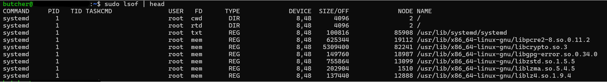

# A closer look at Processes and Resource Utilization

Here we will look at the relationship between process, the kernel and the system resources. The tools we will be discussing can be thought of as performance-monitoring tools. 

## Tracking processes
We are familiar with `ps` command. It gives us a snapshot of the process currently running. `ps` reads data from `/proc` file system (a virtual file system the kernel exposes).

```bash
$ ps aux 
# a= all users
# u= user-oriented format
# x= without TTY, includes proceses not attached to a terminal

# Output
USER         PID %CPU %MEM    VSZ   RSS TTY      STAT START   TIME COMMAND
root           1  0.0  0.0  22280 12428 ?        Ss   15:04   0:01 /sbin/init
root           2  0.0  0.0   3072  1760 ?        Sl   15:04   0:00 /init
```
`top` is an interactive viewer that refreshes every second and highlights the busiest processes at the top. There are two enhanced variants of top. `atop` and `htop`.

### htop


* Header (Top Section)

    * CPU bars (one per core):
        * Green = user processes
        * Red = kernel
        * Blue = low-priority
        * Gray = I/O wait
        * (High usage or lots of gray = problem)

    * Mem bar: Green = apps, Blue = buffers, Yellow = cache (normal to look “full”)
    * Swap bar: Red = swap in use → bad if growing (memory pressure)
    * Right side: Tasks, Load average (1/5/15 min), Uptime

* Process List (Main Area)
    * PID • USER • %CPU • %MEM • VIRT/RES/SHR (memory) • S (state: R=running, S=sleeping, etc.) • TIME+ (CPU time) • Command

## lsof - list open files
It shows which processes have which files open- and vice versa.



***Breakdown***

* COMMAND — Name of the command/process (truncated to 9 characters sometimes).
* PID — Process ID (links back to what you saw in ps or htop).
* USER — Owner of the process.
* FD — File Descriptor (how the process refers to the file internally):
    * cwd = current working directory
    * rtd = root directory
    * txt = the executable itself
    * Numbers like 0, 1, 2 = standard input/output/error
    * 3u, 4r, 5w = file descriptor number + mode (r=read, w=write, u=read/write)

* TYPE — Type of "file":
    * REG = regular file
    * DIR = directory
    * CHR = character device (e.g., terminal)
    * BLK = block device (e.g., disk)
    * FIFO = pipe
    * SOCK = socket (network or Unix domain)

* DEVICE — Device numbers (major,minor) or "memory" for some cases.
* SIZE/OFF — Size of the file or current offset (position) in the file.
* NODE — Inode number (unique identifier inside the filesystem) or protocol info for sockets.
* NAME — Full path to the file, or socket details (e.g., TCP 192.168.1.10:22->203.0.113.5:12345).

***Useful Commands***
```bash
# Files opened by a specific process

sudo lsof -p 1234          # by PID
sudo lsof -c sshd          # by command name (all sshd processes)

# Which process is using a specific file or directory

sudo lsof /home/user/myfile.txt
sudo lsof /mnt/usbdrive     # why can't I unmount?

# Open files for a specific user

sudo lsof -u username
sudo lsof -u ^root         # exclude root (note the ^)

# Network connections and ports

sudo lsof -i               # all internet sockets
sudo lsof -iTCP -i :22     # who is using SSH port 22?
sudo lsof -i :80           # processes listening on or connected to port 80
sudo lsof -iUDP            # UDP only

# Only show PIDs (useful for scripting, e.g., killing)

sudo lsof -t -u username          # just the PIDs
sudo lsof -t /path/to/file

# Combine filters (AND logic with -a)
sudo lsof -a -u username -i :443   # username AND port 443
```

## Tracing program execution and system calls

`strace` traces system calls (the interface between a program and the Linux kernel). It shows exactly what a process is asking the kernel to do (open files, read/write, network, memory allocation, etc.

`ltrace` (library trace) intercepts and displays library function calls (dynamic/shared library calls) made by a program.

Most programs do not make system calls directly. They call library functions (from libc.so, libssl.so, etc.), and those libraries then make the actual system calls.
ltrace gives you the “user-space” view, while strace gives the “kernel boundary” view.

***Basic Command***
```bash
strace <command>               # trace a new command
sudo strace -p <PID>           # attach to a running process (Ctrl+C to detach)
strace -o trace.log <command>  # save output to file

ltrace <command>                 # Trace a new command
sudo ltrace -p <PID>             # Attach to a running process (Ctrl+C to stop)
ltrace -o trace.log <command>    # Save output to a file
```
## Threads
