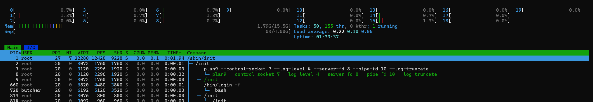

# A closer look at Processes and Resource Utilization

Here we will look at the relationship between process, the kernel and the system resources. The tools we will be discussing can be thought of as performance-monitoring tools. 

## Tracking processes
We are familiar with `ps` command. It gives us a snapshot of the process currently running. `ps` reads data from `/proc` file system (a virtual file system the kernel exposes).

```bash
$ ps aux 
# a= all users
# u= user-oriented format
# x= without TTY, includes proceses not attached to a terminal

# Output
USER         PID %CPU %MEM    VSZ   RSS TTY      STAT START   TIME COMMAND
root           1  0.0  0.0  22280 12428 ?        Ss   15:04   0:01 /sbin/init
root           2  0.0  0.0   3072  1760 ?        Sl   15:04   0:00 /init
```
`top` is an interactive viewer that refreshes every second and highlights the busiest processes at the top. There are two enhanced variants of top. `atop` and `htop`.

### htop



