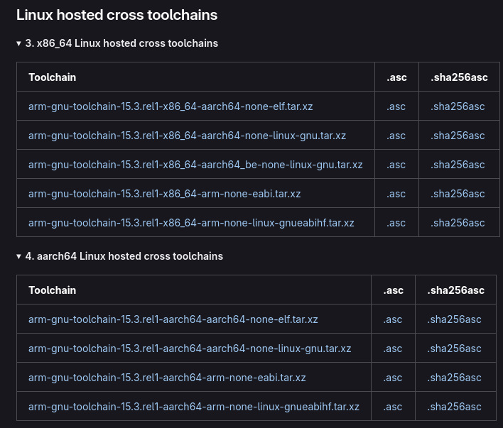
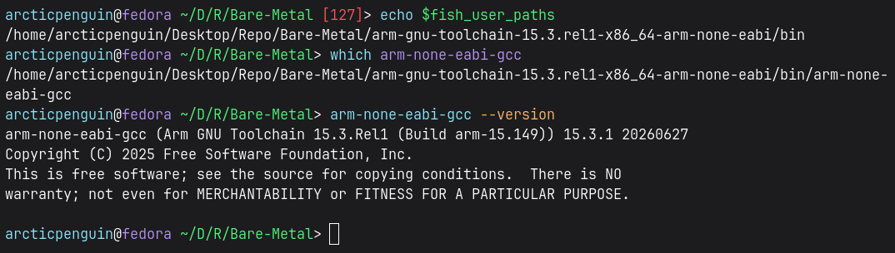

# Bare-Metal Embedded C Programming

Let's be brave and dive into this `bit`ful world of embedded C programming.
First we have to setup our toolset.


## Technical Requirement 
1. The development board we will be using is `NUCLEO-F411`
    ```bash
    NUCLEO-F411RE Development Board
            │
            └── STM32F411RE Microcontroller
                    │
                    └── ARM Cortex-M4 CPU Core
    ```
    To check the STM32 MCUs portfolio - [link](https://www.st.com/en/microcontrollers-microprocessors/stm32-32-bit-arm-cortex-mcus.html)

2. STM32CubeIDE [download link](https://www.st.com/en/development-tools/stm32cubeide.html). I am using the Vscode extension.


3. GNU Arm Embedded Toolchain [link](https://gitlab.arm.com/tooling/gnu-toolchains-for-arm)

    
    ```bash
    arm-gnu-toolchain-15.3.rel1-darwin-arm64-arm-none-eabi.pkg
    │                 │         │            │             │
    │                 │         │            │             └─ Package format
    │                 │         │            └─ Target architecture
    │                 │         └─ Host: Apple Silicon macOS
    │                 └─ Toolchain version
    └─ Arm GNU Toolchain
    ```

    Let's dissect the target architecture:
    ```bash
    arm  -  none  -  eabi
    │       │       │
    │       │       └── Embedded Application Binary Interface
    │       └────────── No operating system
    └────────────────── 32-bit ARM target
    ```
    I would prefer `.pkg` over `.tar.xz` as a beginner. `.pkg` will install as regular macOS software package. With `.tar.xz`, we have granular control.

    Now our choice filters down to `eabi` or `elf`. Arm officially labels aarch64-none-elf as the AArch64 bare-metal target and arm-none-eabi as the AArch32 bare-metal target.

    Since NUCLEO-F411RE has ARM-Cortex M4 which is 32-bit core, our option boils down to 
    ```bash
    arm-gnu-toolchain-15.3.rel1-darwin-arm64-arm-none-eabi.pkg
    ```
    Here is the download [link](https://gitlab.arm.com/api/v4/projects/tooling%2Fgnu-toolchains-for-arm/packages/generic/gnu-toolchain/15.3.rel1/arm-gnu-toolchain-15.3.rel1-darwin-arm64-arm-none-eabi.pkg)

    ***For my Fedora machine***

    

    Since I am on a Fedora machine, which is x86_64, I will need `x86_64 Linux hosted, arm-none-eabi target` toolchain

    > [arm-gnu-toolchain-15.3.rel1-x86_64-arm-none-eabi.tar.xz](https://gitlab.arm.com/api/v4/projects/tooling%2Fgnu-toolchains-for-arm/packages/generic/gnu-toolchain/15.3.rel1/arm-gnu-toolchain-15.3.rel1-x86_64-arm-none-eabi.tar.xz)


    Installation Process:
    ```bash
    # 1. Save it somewhere other than Downlaods folder where you will not delete it.
    ```
    ```bash
    # 2. Extract
    tar -xJf arm-gnu-toolchain-15.3.rel1-x86_64-arm-none-eabi.tar.xz
    ```
    *  x : extract
    * J : filter through xz for decompression (this is what handles the .xz compression format specifically — z would be gzip/.gz, j would be bzip2/.bz2
    * f : the next argument is the filename to operate on (without this, tar expects input from stdin)
    
    ```bash
    # 3. Add bin/ to PATH in fish
    
    arcticpenguin@fedora ~/D/R/Bare-Metal> fish_add_path ~/Desktop/Repo/Bare-Metal/arm-gnu-toolchain-15.3.rel1-x86_64-arm-none-eabi/bin

    # Output
    set -U fish_user_paths /home/arcticpenguin/Desktop/Repo/Bare-Metal/arm-gnu-toolchain-15.3.rel1-x86_64-arm-none-eabi/bin
    ```
    Since I am using fish, unlike bash, I will have to add it to bin/ to PATH in fish

    To confirm
    ```fish
    echo $fish_user_paths
    which arm-none-eabi-gcc
    arm-none-eabi-gcc --version
    ```
    
    


4. OpenOCD 
    * Installation [instruction](https://xpack-dev-tools.github.io/openocd-xpack/docs/install/)
    * Package [Repo](https://github.com/xpack-dev-tools/openocd-xpack/releases)

    We will revisit this topic later when we start our project.


