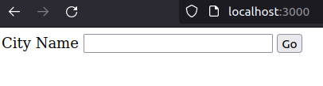
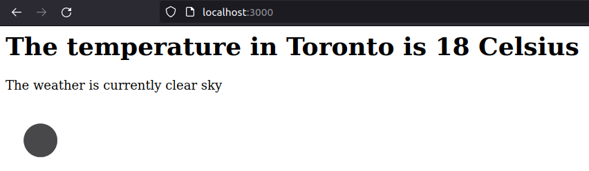

# Application Programming Interfaces

It is a set of commands, functions, protocols, and objects that programmers can use to create software or interact with an external system.

- Endpoints
- Paths
- Parameters
- Authentication

### Example

[JokeAPI Documentation](https://sv443.net/jokeapi/v2/)

```cassandra
Endpoint+ Paths+ Parameters+ Authentication

https://v2.jokeapi.dev/joke/Programming?type=twopart&contains=JavaScript

Endpoint: https://v2.jokeapi.dev/joke/
Path: Programming
Parameter(Key Value pair): ?type=twopart&contains=JavaScript

```

[Postman API Platform](https://www.postman.com/)

[JSON](https://www.json.org/json-en.html)

JavaScript Object Notation. Other formats can be XML and HTML

### [HTTPS Request in nodeJs](https://nodejs.org/api/https.html)

```javascript
const https = require('https');

https.get('https://encrypted.google.com/', (res) => {
  console.log('statusCode:', res.statusCode);
  console.log('headers:', res.headers);

  res.on('data', (d) => {
    process.stdout.write(d);
  });

}).on('error', (e) => {
  console.error(e);
});
```

[HTTP_Status_Code](https://developer.mozilla.org/en-US/docs/Web/HTTP/Status)

[httpstatusdogs.com](https://httpstatusdogs.com/)

### [Weather API](https://openweathermap.org/)

I used  weather API to query a city name and display the temperature, weather description and weather symbols of that place.

```html
<body>
    <form action="/" method="post">
        <label for="cityInput">City Name</label>
        <input  id="cityInput" type="text" name="cityName">
        <button type="submit">Go</button>
    </form>
</body>
```



```javascript
const express=require("express");
const https=require("https");
const bodyParser=require("body-parser");

const app=express();
app.use(bodyParser.urlencoded({extended:true}));

app.get("/",function(req,res){
    res.sendFile(__dirname+"/index.html")

 
})
app.post("/", function(req,res){
    // console.log("Post request received");
    // console.log(req.body.cityName);
    const query=req.body.cityName;
    const apikey="*********************";
    const unit="metric";
    const url="https://api.openweathermap.org/data/2.5/weather?q="+query+"&units="+unit+"&appid="+apikey

    https.get(url,function(response){
        console.log(response.statusCode);

        response.on("data",function(data){
            const weatherData=JSON.parse(data);
            const weatherDescription=weatherData.weather[0].description;
            const temp=weatherData.main.temp;
            const img=weatherData.weather[0].icon;
            const imageurl="https://openweathermap.org/img/wn/"+img+"@2x.png";

            // console.log(weatherData);
            console.log(weatherDescription);
            console.log(temp);
            console.log(img);

            
            res.write("<h1>The temperature in Toronto is "+ temp+" Celsius</h1>");
            res.write("<p>The weather is currently "+ weatherDescription+"</p>");
            res.write("");
            res.send();
        })
    })
})

app.listen(3000, function(){
    console.log("Server is running on port 3000");
})
```



### References

https://nodejs.org/en/docs/

https://blog.hubspot.com/website/application-programming-interface-api

https://towardsdatascience.com/what-is-an-api-and-how-does-it-work-1dccd7a8219e

https://openweathermap.org/

