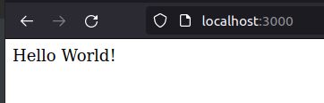

# Express 

[Official Website](https://expressjs.com/)

Nodejs is a screwdriver, you can fix things with it. Express is like the motorized screwdriver which does all the heavy lifting for us.

Fast, unopinionated, minimalist web framework for [Node.js](https://nodejs.org/en/)

### [Installation](https://expressjs.com/en/starter/installing.html)

```bash
npm install express
```

[Hello World Example](https://expressjs.com/en/starter/hello-world.html)

```javascript
const express =require("express");
const app = express();

app.get("/",function(request,response){
response.send("Hello World!");
});

app.listen(3000, function(){
    console.log("Server started on port 3000");
});
```



```javascript
const express = require('express')
const app = express()
const port = 3000

app.get('/', (req, res) => {
  res.send('Hello World!')
})

app.listen(port, () => {
  console.log(`Example app listening at http://localhost:${port}`)
})
```

### Understanding and Working with Route

```javascript
//Route to home page
app.get("/",function(request,response){
response.send("Hello World!");
});
//Route to Contact Me
app.get("/contact",function(request,response){
response.send("Contat Me");
});
```

### [nodemon](https://nodemon.io/)

Nodemon is a utility that will monitor for any changes in your source and automatically restart your server. Perfect for development.

```bash
sudo npm install -g nodemon
```

### HTTP Return Code Cheat Sheet

| 1**  | Hold on       |
| ---- | ------------- |
| 2**  | Here You Go   |
| 3**  | Go Away       |
| 4**  | You tucked up |
| 5**  | I tucked up   |

### Making a Simple Calculator

<u>Steps</u>

```bash
npm init
npm install express
touch calculator.js
touch index.html
npm install body-parser
nodemon calculator.js
```

```html
<body>
    <form action="/" method="post">
        <input type="text" name="num1" placeholder="First Number">
        <input type="text" name="num2" placeholder="Second Number">
        <button type="submit" name="submit">Calculate</button>
    </form>
</body>
```

```javascript
const express =require("express");
const bodyParser=require("body-parser");

const app = express();
app.use(bodyParser.urlencoded({extended: true}));

app.get("/",function(request,response){
response.sendFile(__dirname + "/index.html");
});

//__dirname: Current File Location
    
app.post("/",function(request,response){
    console.log(request.body.num1);
    console.log(request.body.num2);
    var num1=Number(request.body.num1);
    var num2=Number(request.body.num2);
    var result=num1+num2;
    response.send("The result is "+result);
});
app.listen(3000, function(){
    console.log("Server started on port 3000");
});
```

