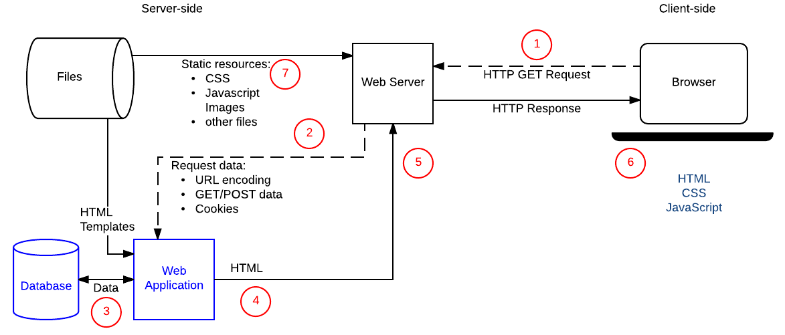

# Server Side Programming

### Static Sites

### Dynamic Sites

### [Client-Server Overview](https://developer.mozilla.org/en-US/docs/Learn/Server-side/First_steps/Client-Server_overview)

#### Request

Web browsers communicate with [web servers](https://developer.mozilla.org/en-US/docs/Learn/Common_questions/What_is_a_web_server) using the **H**yper**T**ext **T**ransfer **P**rotocol ([HTTP](https://developer.mozilla.org/en-US/docs/Web/HTTP)). When you click a link on a web page, submit a form, or run a search, the browser sends an *HTTP Request* to the server.

This request includes: 

- A URL identifying the target server
- A method that defines the required action
  - GET: Get a specific resource
  - POST: Create a new resource
  - HEAD: Get the metadata information about a specific resource without getting the body like `GET` would.
  - PUT: Update an existing resource (or create a new one if it doesn't exist)
  - DELETE: Delete the specified resource
  - TRACE, OPTIONS, CONNECT, PATCH 
- Additional Information can be encoded with the request. information can be encoded as :
  - URL parameters: `GET` requests encode data in the URL sent to the server by adding name/value pairs onto the end of it — for example `http://mysite.com**?name=Fred&age=11**`. You always have a question mark (`?`) separating the rest of the URL from the URL parameters, an equals sign (`=`) separating each name from its associated value, and an ampersand (`&`) separating each pair. URL parameters are inherently "insecure" as they  can be changed by users and then resubmitted. As a result URL  parameters/`GET` requests are not used for requests that update data on the server.
  - `POST` data: `POST` requests add new resources, the data for which is encoded within the request body.
  - Client-side cookies: Cookies contain session data about the client,  including keys that the server can use to determine their login status  and permissions/accesses to resources.

#### Response

The response contains an [HTTP Response status code](https://developer.mozilla.org/en-US/docs/Web/HTTP/Status) indicating whether or not the request succeeded (e.g. "`200 OK`" for success, "`404 Not Found`" if the resource cannot be found, "`403 Forbidden`" if the user isn't authorized to see the resource, etc).

[GET request/response example](https://developer.mozilla.org/en-US/docs/Learn/Server-side/First_steps/Client-Server_overview#get_requestresponse_example)

[POST request/response example](https://developer.mozilla.org/en-US/docs/Learn/Server-side/First_steps/Client-Server_overview#post_requestresponse_example)

### What is Web frameworks?

Web frameworks are collections of functions, objects, rules and other  code constructs designed to solve common problems, speed up development, and simplify the different types of tasks faced in a particular domain.

### References

https://developer.mozilla.org/en-US/docs/Learn/Server-side/First_steps

https://developer.mozilla.org/en-US/docs/Learn/Server-side/First_steps/Client-Server_overview

