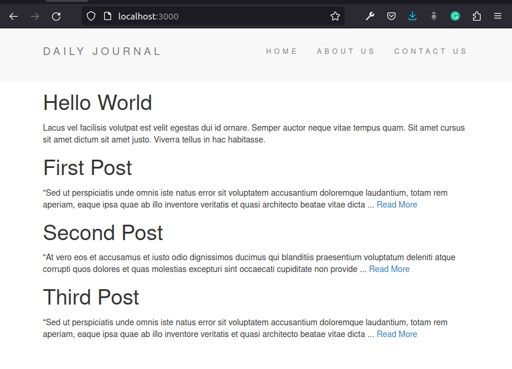

# Making My Blog

Now that I know the basics of nodeJs and express, it is time for me to put that knowledge into practice. I am following [API reference-Express 4.X](https://expressjs.com/en/api.html) whenever I have to find something or run into any kind of problem. Lets go.....

### Starting Point

```javascript
const express = require("express");
const ejs = require("ejs");

const app = express();

app.set('view engine', 'ejs');
app.use(express.json());
app.use(express.urlencoded({extended:true}));
app.use(express.static("public"));

app.get("/", function(req,res){
  res.render("Hello World");
});

app.listen(3000, function() {
  console.log("Server started on port 3000");
});

```

### [Basic Routing](https://expressjs.com/en/starter/basic-routing.html)

*Routing* refers to determining how an application responds to a  client request to a particular endpoint, which is a URI (or path) and a  specific HTTP request method (GET, POST, and so on).

Each route can have one or more handler functions, which are executed when the route is matched.

```javascript
app.METHOD(PATH, HANDLER)

//Example
app.get('/', function (req, res) {
  res.send('Hello World!')
})
```

Where:

- `app` is an instance of `express`.
- `METHOD` is an [HTTP request method](https://en.wikipedia.org/wiki/Hypertext_Transfer_Protocol#Request_methods), in lowercase.
- `PATH` is a path on the server.
- `HANDLER` is the function executed when the route is matched.

### [Routing Parameters](https://expressjs.com/en/guide/routing.html)

Route parameters are named URL segments that are used to capture the  values specified at their position in the URL. The captured values are  populated in the `req.params` object, with the name of the route parameter specified in the path as their respective keys.

```javascript
Route path: /users/:userId/books/:bookId
Request URL: http://localhost:3000/users/34/books/8989
req.params: { "userId": "34", "bookId": "8989" }
```

```javascript
app.get('/users/:userId/books/:bookId', function (req, res) {
  res.send(req.params)
})
```

**Note:** The name of route parameters must be made up of “word characters” ([A-Za-z0-9_])

```javascript
app.get("/posts/:postName", function(req,res){
  const requestedTitle=req.params.postName;

  allPost.forEach(function(post){
    const storedTitle=post.postTitle;
    if (storedTitle===requestedTitle){
      console.log("Match Found");
    }
    else{
      console.log("Not Found");
    }
  });
});
```

### Rendering home.ejs as the root page

```javascript
res.render(view [, locals] [, callback])

res.render('home.ejs');
```

### [EJS References](https://ejs.co/)

```ejs
<%= Outputs the value into the template (HTML escaped)
```

```javascript
// In home.ejs
<h1> Hello World</h1>
<p> <%= StartingContent %> </p>

//In app.js
app.get("/", function(req,res){
  res.render('home',{"StartingContent":homeStartingContent});
  });
```

### Adding header and footer

```javascript
<%- Outputs the unescaped value into the template

// In home.js
<%- include("header") -%>
<h1>Hello World</h1>
<p><%= StartingContent %></p>
<%- include("footer") -%>
```

Now creating a partials directory inside the views ti include our header and footer ejs files there, we can modify the above code as below:

```javascript
<%- include partials/header -%>
<h1>Hello World</h1>
<p><%= StartingContent %></p>
<%- include partials/footer -%>
```

### Submit the form entry

```html
// In compose.ejs
<form action="/compose" method="post">
    <label for="title">Title</label><br>
    <input type="text" name="title">
    <button type="submit">Publish</button>
</form>
```

```javascript
app.post("/compose", function(req,res){
  let data=req.body.title;
  console.log(data);
});
```

### [Array.protype.forEach()](https://developer.mozilla.org/en-US/docs/Web/JavaScript/Reference/Global_Objects/Array/forEach)

```javascript
const array1 = ['a', 'b', 'c'];

array1.forEach(element => console.log(element));

// expected output: "a"
// expected output: "b"
// expected output: "c"
```

### [Lodash](https://lodash.com/)

Why Lodash?

Lodash makes JavaScript easier by taking the hassle out of working with arrays, numbers, objects, strings, etc. Lodash’s modular methods are great for:

- Iterating arrays, objects, & strings
- Manipulating & testing values
- Creating composite functions

```shell
npm i lodash
```

```javascript
// In app.js
const _ =require("lodash");

//Using _.lowrCase()
 const requestedTitle=_.lowerCase(req.params.postName);


```

### String substring() Method

```html
<p>
    <%= element.postBody.substring(0,200)+" ..." %>
    <a href="/posts/<%=element.postTitle %>">Read More</a>
</p>
```

### Source Code

```javascript
// app.js
const express = require("express");
const ejs = require("ejs");
const _ =require("lodash");

const homeStartingContent = "Lacus vel facilisis volutpat est velit egestas dui id ornare.";

const aboutContent = "Hac habitasse platea dictumst vestibulum rhoncus est pellentesque.";

const contactContent = "Scelerisque eleifend donec pretium vulputate sapien.";

const app = express();
app.set('view engine', 'ejs');
app.use(express.json());
app.use(express.urlencoded({extended:true}));
app.use(express.static("public"));

var allPost=[];

app.get("/", function(req,res){
  res.render('home',{
    "StartingContent":homeStartingContent,
    "allPost":allPost
  });
});

app.get("/about", function(req,res){
  res.render('about',{"StartingContent":aboutContent});
});

app.get("/contact", function(req,res){
  res.render('contact',{"StartingContent":contactContent});
});

app.get("/compose", function(req,res){
  res.render('compose');
});

app.post("/compose", function(req,res){
  const post={
    "postTitle": req.body.postTitle,
    "postBody":req.body.postBody
  };
  allPost.push(post);
  res.redirect("/");
});

app.get("/posts/:postName", function(req,res){
  const requestedTitle=_.lowerCase(req.params.postName);

  allPost.forEach(function(post){
    const storedTitle=_.lowerCase(post.postTitle);
    if (storedTitle===requestedTitle){
      res.render("post",{
        title:post.postTitle,
        content: post.postBody
      });
    }
    else{
      console.log("Not Found");
    }
  });
});

app.listen(3000, function() {
  console.log("Server started on port 3000");
});
```

### Result



This is not the end. It is just the foundation of my blog. I will share the full source code when this project is completed.

### References

https://expressjs.com/en/starter/basic-routing.html

https://lodash.com/