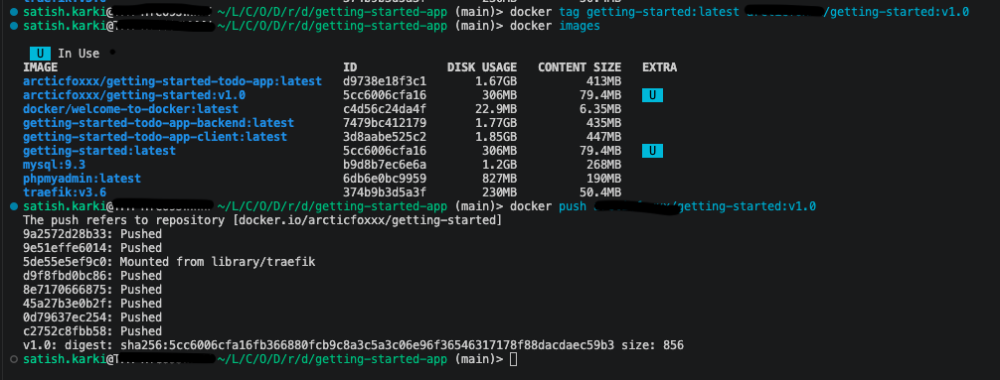
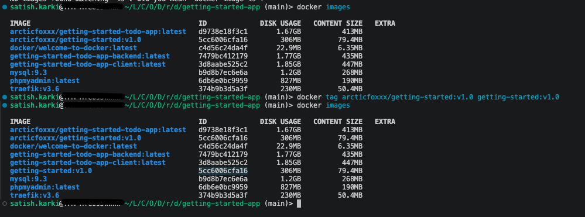
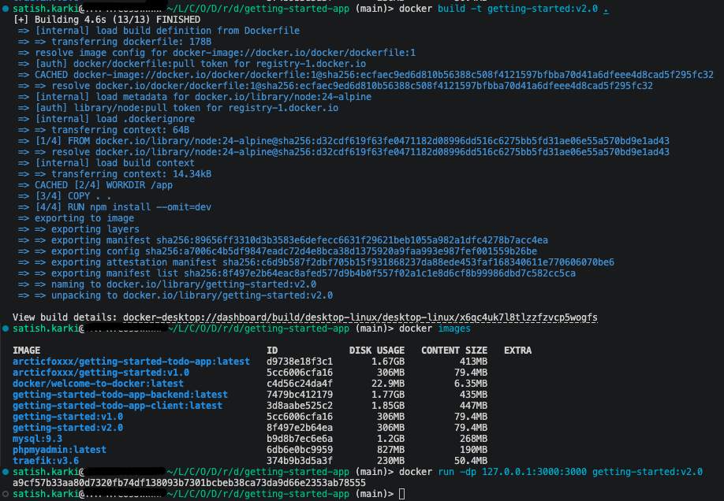
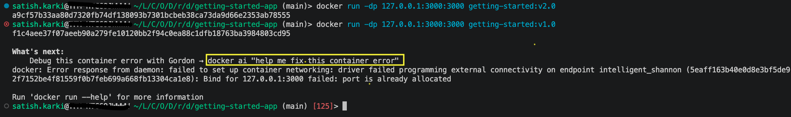
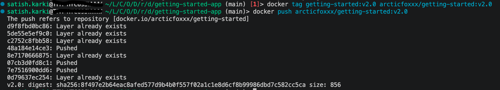

# Docker : Core Concepts

* Docker: The tool/platform that manages everything
* Image: The packaged blueprint/template for an application
* Container: an instance created from that image, usually where the application actually runs

```bash
Dockerfile
    |
    | docker build
    v
  IMAGE
    |
    | docker run
    v
 CONTAINER
 ```

## Two important principles of images
* Images are immutable. Once an image is created, it can't be modified. You can only make a new image or add changes on top of it.
* Containers are composed of layers. Each layer represents a set of file system changes that add, remove, or modify files.

```bash
                IMAGE

        ┌─────────────────┐
        │ Layer 4: app.py │
        ├─────────────────┤
        │ Layer 3: Flask  │
        ├─────────────────┤
        │ Layer 2: Python │
        ├─────────────────┤
        │ Layer 1: Ubuntu │
        └─────────────────┘
                ↑
            all read-only
            all immutable


            docker run
                ↓


             CONTAINER

        ┌─────────────────┐
        │ Writable layer  │ ← container changes
        ├─────────────────┤
        │ Layer 4         │
        ├─────────────────┤
        │ Layer 3         │
        ├─────────────────┤
        │ Layer 2         │
        ├─────────────────┤
        │ Layer 1         │
        └─────────────────┘
```
> Docker doesn't edit an existing image. It builds new filesystem changes as layers, while containers get their own writable layer on top of the image.

## Registry 
An image registry is a place where Docker images are stored and distributed.

Think of it like an app store for Docker images.
[Docker Hub](https://hub.docker.com/) is a public registry that anyone can use and is the default registry.


> Note : A registry is a centralized location that stores and manages container images, whereas a repository is a collection of related container images within a registry. 

```bash
Docker Hub                ← Registry

nginx                     ← Repository
├── nginx:1.27
├── nginx:1.28
└── nginx:latest

redis                     ← Repository
├── redis:7
├── redis:8
└── redis:latest
```

## Docker Compose

`Dockerfile` describes how to build an image and `compose.yaml` describes how to run one or more containers together.
```bash
Dockerfile
    |
    | docker build
    v
  IMAGE
    |
    |
    +-------------------+
                        |
                  compose.yaml
                        |
                        | docker compose up
                        v
                 CONTAINER(S)
```
Conceptually :

```bash
docker compose up -d --build
```

```bash
Dockerfile
    |
    | --build
    v
new/rebuilt image
    |
    | up
    v
container
    |
    | -d
    v
runs in background
```
# Docker Workshop

I am following the [Docker Workshop](https://docs.docker.com/get-started/workshop/) guide.


## Part 1: [Containerize an app](https://docs.docker.com/get-started/workshop/02_our_app/)

### A. Clone the repo
```bash
git clone https://github.com/docker/getting-started-app.git
```

### B. Creating the dockerfile
```dockerfile
# syntax=docker/dockerfile:1

FROM node:24-alpine
WORKDIR /app
COPY . .
RUN npm install --omit=dev
CMD ["node", "src/index.js"]
EXPOSE 3000
```
This Dockerfile does the following:

* Uses node:24-alpine as the base image, a lightweight Linux image with Node.js pre-installed
* Sets /app as the working directory
* Copies source code into the image
* Installs the necessary dependencies
* Specifies the command to start the application
* Documents that the app listens on port 3000

```bash
Your final image
┌───────────────────────┐
│ Your application      │
├───────────────────────┤
│ npm dependencies      │
├───────────────────────┤
│ Node.js               │
├───────────────────────┤
│ Alpine Linux          │
└───────────────────────┘
```

### C. Build the image
```bash
docker build -t getting-started .
```
```bash
docker build -t getting-started .
│      │     │        │         │
│      │     │        │         └─ build context: current directory
│      │     │        └───────── image name
│      │     └────────────────── tag/name option
│      └──────────────────────── build an image
└─────────────────────────────── Docker CLI
```

### D. Start an app container
```bash
docker run -d -p 127.0.0.1:3000:3000 getting-started
```
```bash
docker run -d -p 127.0.0.1:3000:3000 getting-started
│      │   │  │         │    │       │
│      │   │  │         │    │       └─ image
│      │   │  │         │    └──────── container port
│      │   │  │         └───────────── host port
│      │   │  └─────────────────────── host IP
│      │   └────────────────────────── publish a port
│      └────────────────────────────── detached/background
└───────────────────────────────────── Docker
```

Let's say I want to upload this image to my docker hub (repo). Here is how I will do it:
```bash
docker tag local-image:tagname new-repo:tagname
docker push new-repo:tagname
```
***Example***
```bash
docker tag getting-started:latest username/getting-started:v1.0
docker push username/getting-started:v1.0
```



### E. Stop an app container
```bash
docker stop <container id> # This will stop the container only
docker rm <contianer id> # Remvoe the container

# To find the running contianers we can use 
docker ps # Shows running containers
docker ps -a # Shows running and stopped containers as well
```

### F. What if I remove the image file 
```bash
docker rmi getting-started
#OR
docker image rm getting-started
```
One thing to note is that, the following command will not delete the remove repo
```bash
docker rmi username/getting-started:v1.0
```
If we need to pull the image again then we can use 
```bash
docker pull username/getting-started
```

Here, after removing the local image and pulling it from repo, I noticed the image is name as `username/getting-started:v1.0` instead of `getting-started:latest`.  No worries, we can create a local alias.

```bash
docker tag username/getting-started:v1.0 getting-started:v1.0
```


On the above screenshot, as we can see the alias points to same docker image ID.

I will stop here and let's move on to next topic. Hopefully, I am expecting `Part 2` will cover the images immutable feature and also image versioning. That would be cool. Let's dig in.

## Part 2 : [Update the application](https://docs.docker.com/get-started/workshop/03_updating_app/)


Looks like this cover the `Steps E` from `Part 1`.
### Step A. Update the source code
```js
- <p className="text-center">No items yet! Add one above!</p>
+ <p className="text-center">You have no todo items yet! Add one above!</p>
```
### Step B. Build the updated version

```bash
docker run -dp 127.0.0.1:3000:3000 getting-started:v2.0
```



Here as you can see on the screenshot, it didn't throw any error as I already stopped and removed the container created by image `getting-started:v1.0`. What if it was running? - I will be getting `Bind for 127.0.0.1:3000 failed:` because the old container is already using the host's port 3000 and only one process on the machine(containers included) can listen to specific port.

Let's try the other way around. Let's spin on the container from v1.0 while v2.0 is still running to test the theory.

Tadaaa!!!


I am more surprised with the suggestion `docker ai "help me fix this container error"`. Are we gonna be so dependent on AI that we eventually have to ask GPT-Hey how to wipe my ass? Where is human intelligence going collectively? Is this what singularity looks like? AI improving day by day and human intelligence degrading second by second? I guess so. Ironically, I had to ask the GPT- ` docker ai` is Docker's new feature?  And yes, it is docker's built-in AI assistant `Gordon`. Hey `Gordon` I hope you don't mind my little rant. Anyway, lets move on, getting side-tracked here.

>Note: It seems the container didn't start, but it was created. So it will be wise to use a different port if you want to run it or if not remove it.

### Step C. If I want to push v2.0 to my repo

```bash
docker tag getting-started:v2.0 username/getting-started:v2.0
docker push username/getting-started:v2.0
```


Next we will look into sharing the application.

### Part 3 : [Share the application](https://docs.docker.com/get-started/workshop/04_sharing_app/)


