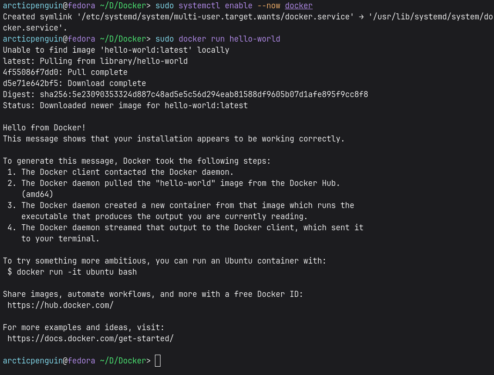

I installed Docker desktop on my Mac to be familiar with docker. Docker desktop creates a Linux VM and runs container on it. Now on my Fedora machine, installing Docker Desktop will only create overhead of running another VM, so I plan to install docker engine instead.

Let's look at the [installation steps](https://docs.docker.com/engine/install/fedora/)

## 1. Uninstall old version
```bash
sudo dnf remove docker \
                  docker-client \
                  docker-client-latest \
                  docker-common \
                  docker-latest \
                  docker-latest-logrotate \
                  docker-logrotate \
                  docker-selinux \
                  docker-engine-selinux \
                  docker-engine
```

## 2. Setup rpm repository
```bash
sudo dnf config-manager addrepo --from-repofile https://download.docker.com/linux/fedora/docker-ce.repo
```
Next time we run `dnf install` or `update`, dnf will also check Docker's repo for packages.

We can verify it with 
```bash
dnf repolist | grep docker
```
## 3. Install Docket packages
```bash
sudo dnf install docker-ce docker-ce-cli containerd.io docker-buildx-plugin docker-compose-plugin
```
* docker-ce - the core Docker Engine itself: the dockerd daemon that actually builds, runs, and manages containers, images, networks, and volumes.
* docker-ce-cli - the docker command-line tool you type in the terminal. Talks to the daemon over its API to issue commands like docker run, docker ps, docker build.
* containerd.io - the lower-level container runtime that Docker Engine relies on under the hood to actually start/stop containers and manage their lifecycle (it's a separate CNCF project that Docker builds on top of).
* docker-buildx-plugin - adds docker buildx, an extended build tool with support for multi-platform builds (e.g., building an ARM image on an x86 machine), build caching, and other advanced BuildKit features. Without it, you're stuck with the older, more limited docker build.
* docker-compose-plugin - adds docker compose (the newer, plugin-based version - no hyphen), letting you define and run multi-container setups from a docker-compose.yml file. This replaces the old standalone docker-compose Python tool.

## 4. Start docker engine
```bash
sudo systemctl enable --now docker
```
This configures the Docker systemd service to start automatically when you boot your system. If you don't want Docker to start automatically, use `sudo systemctl start docker` instead.

## 5. Verify the installation is successful

```bash
sudo docker run hello-world
```



