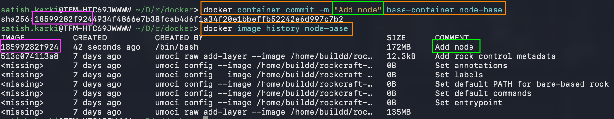
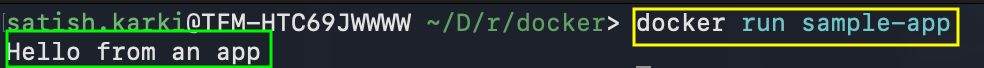
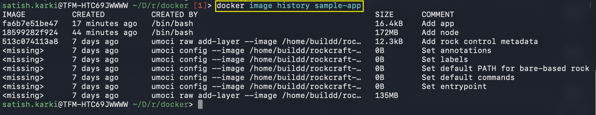
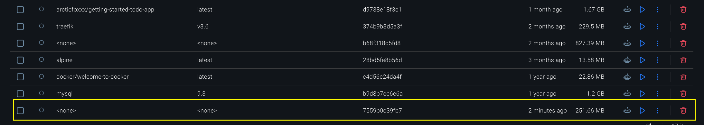
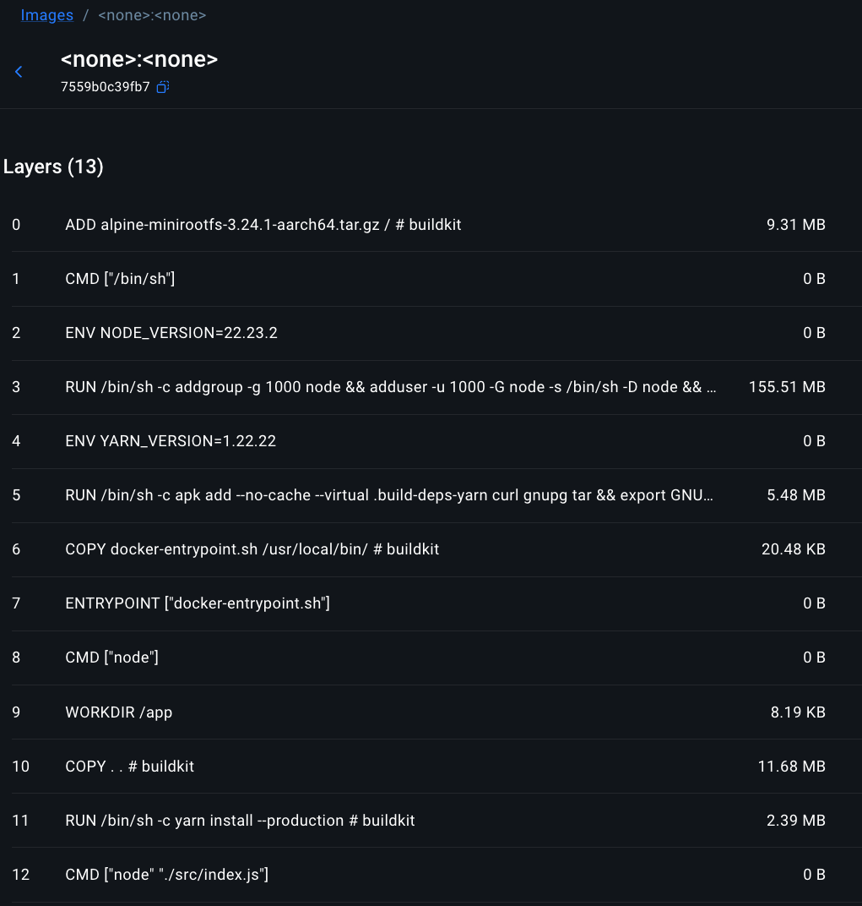

# Building images
The docker workshop I was following suddenly disappeared from the docker website.
The official content of the Docker site is slightly different than I was used. This seems to be a new section describing the images layers, writing a Docker file, build/tag/publish an image(covered in topic - core concept), using the build cache and multi-stage builds.

Here is the [official document](https://docs.docker.com/get-started/docker-concepts/building-images/) if you want to follow along.

## Image Layers
We briefly touched about it in [Core Concepts](https://satishkarki.com/posts/Docker-Core-Concepts/) post. Let's dive deep.

Image Layers can be summed up in one sentence as:

`It is a reusable piece of an image that represents a set of filesystem changes.`

```c
Layer 1: Start with Ubuntu
Layer 2: Install Node.js
Layer 3: Copy your application files
Layer 4: Install app dependencies
```
A set of file changes - What does it mean? Meaning each layer makes changes to the file system of underlying layer. Let's say Ubuntu is installed as base layer. The next layer will install Node.js on that Ubuntu. Maybe node.js gets installed on file path `/usr/local/lib/` of Ubuntu as an example. Then maybe on Layer 3, the app.js gets copied to `/app/app.js` and so on. 

In above example, I said each layer make changes to the underlying filesystem. That might give you a wrong idea. In reality, Docker keeps these layers physically separate. This leads us to extend images of others by reusing their base layers, allowing us to add the data only our application needs.

```bash
Layer 3: Your application
         /app/main.py

Layer 2: Python
         /usr/bin/python

Layer 1: Debian
         /bin/
         /etc/
         /usr/
```
But when you run the image, Docker presents them to the container as though they were one filesystem (unified view):

```bash
/
├── app/
│   └── main.py
├── bin/
├── etc/
└── usr/
    └── bin/
        └── python
```

## Stacking the layers
Layering is made possible by content-addressable storage and union filesystems.

**1. Content-addressable storage**

Docker identifies a layer by what is inside it, rather than mainly by a filename or location.
```bash
Layer contents
     ↓
Calculate a hash
     ↓
sha256:abc123...
```
That hash acts like a fingerprint for the layer.

**2. Union File System**

I touched it above already. Docker keeps each layer separate. But a unified view is given to container by this union file system.

Docker makes the merged image filesystem become the container's root filesystem `/`. using `chroot`. Conceptually, `chroot` changes what `/` means for that process.

The container thinks:
> "This is my entire filesystem."


Once the stacking of the layer is done. Docker adds one more container writeable layer:
```bash
┌────────────────────────────┐
│ Container writable layer   │ ← changes happen here
├────────────────────────────┤
│ App image layer            │
├────────────────────────────┤
│ Python layer               │
├────────────────────────────┤
│ Debian layer               │
└────────────────────────────┘
```
What does it mean? 
Suppose the running application creates 
```bash
/app/log.txt
```
Docker doesn't modify the image layer. Instead, 
```bash
Container writable layer
    /app/log.txt      ← NEW

App layer
    /app/main.py

Python layer

Debian layer
```
But inside the container, it will see a unified view of filesystem.
```bash
/app/
├── main.py
└── log.txt
```


## Let's create a base image

```bash
# Start an Ubuntu container, call it base-container, and give me an interactive terminal inside it.
docker run --name=base-container -ti ubuntu
```
If I have to get into the interactive cell again later. I can use
```bash
docker start -ai base-container
# -a : Attach your terminal to it
# -i : keep it interactive

docker exec -it base-container bash
# If the container is already running
```
 Inside the container, install nodejs

 ```bash
 apt update && apt install -y nodejs
 ```
In the context of the union filesystem, these filesystem changes occur within the directory unique to this container.

Now, let's check if nodejs is installed
```bash
node -e 'console.log("Hello world!")'
```
Our base image was Ubuntu, but we installed Node on it. Let's save these changes as a new image layer, from which we can start a new container or build new images.

```bash
docker container commit -m "Add node" base-container node-base
```
> What's happening here? Take a snapshot of this container's filesystem changes and turn that snapshot into a new image called node-base.

Let's view the layers of the new image
```bash
docker image history node-base
```


To confirm, we have can run 
```bash
docker run node-base node -e "console.log('Hello again')"
```
Now we are done with the creation of base image, let's remove the container
```bash
docker rm -f base-container
```
## Let's build an app image

Now we will create an app image on top of the node-base image we created above.

```bash
docker run --name=app-container -ti node-base
```
Inside of this container, run the following command to create a Node program.
```bash
echo 'console.log("Hello from an app")' > app.js
node app.js # To run the node program
```

Save container's changes as a new image
```bash
docker container commit -c "CMD node app.js" -m "Add app" app-container sample-app
```
* This command does two things at once: it saves the filesystem changes from `app-container` into a new image `sample-app`, and it tells that new image what command to run by default.
* `-c "CMD node app.js"`: `-c` means change the configuration of the new image, `CMD node app.js` means When someone starts a container from this image, run node app.js by default.

So If I run `docker run sample-app`, I will get



Now let's look at the newly created `sample-app` image history:


Looks familiar? Compare the changes with the base image.

## Writing a Dockerfile 


A Dockerfile is a text-based document that's used to create a container image. It provides instructions to the image builder on the commands to run, files to copy, startup command, and more.

[Instruction](https://docs.docker.com/get-started/docker-concepts/building-images/writing-a-dockerfile/)

```dockerfile
FROM node:22-alpine

WORKDIR /app

COPY . .

RUN yarn install --production

CMD ["node", "./src/index.js"]
```
Let's break it down: 

* `node:22-alpine` : node:22-alpine already gives you a lightweight Alpine Linux environment with Node.js installed. Use this existing image as my foundation.
* `WORKDIR /app` : Docker defines WORKDIR as the directory where subsequent commands execute and where relative paths are based.

    ```bash
    Container filesystem

    /
    ├── bin
    ├── etc
    ├── usr
    ├── var
    └── app  ← we are working here
    ```
* `COPY . .` : Copy files from my current project and put them in the current working directory inside the image.
    ```bash
    Docker image
    /
    └── app/
        ├── package.json
        ├── yarn.lock
        └── src/
            └── index.js
    ```
* `RUN yarn install --production` : means - While building the image, execute this command.

* `CMD ["node", "./src/index.js"]` : When someone creates a container from this image, run the application using this command.

    Conceptually: 
    ```bash
    node ./src/index.js
    ```
    So when we run `docker run my-app`, it is doing `docker run my-app node ./src/index.js`

This Dockerdfile is not production ready yet. It is recommended to follow the best practices to make the image maximize the build cache, run as a non-root user, and multi-stage builds.

* [Dockerfile reference](https://docs.docker.com/reference/dockerfile/)
* [Docker best practices](https://docs.docker.com/develop/develop-images/dockerfile_best-practices/)
* [Base images](https://docs.docker.com/build/building/base-images/)

## Build, tag and publish an image

I already covered this in detail in Docker 101 and Docker 102 post. So I will keep it short and sweet here.

```bash
Docker build .
```
The final `.` in the command provides the path or URL to the build context. At this location, the builder will find the Dockerfile and other referenced files.



As we can see in the above screenshot, if I run `dicker build .` the image created doesn't have a name.

Also, while we are at it, lets look at the layers it created. It gives us a insight of our Dockerfile.


Let's fix the name issue with tags.

### Tagging
Tagging images is the method to provide an image with a memorable name. However, there is a structure to the name of an image. A full image name has the following structure:

```bash
[HOST[:PORT_NUMBER]/]PATH[:TAG]
```


    


