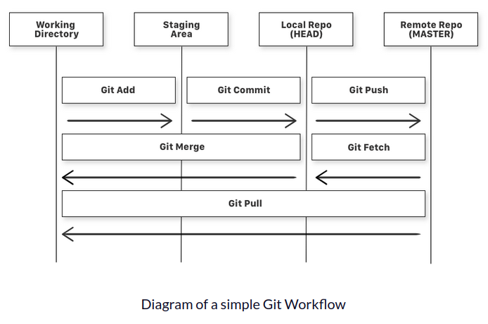

# **Git to Know**

-  Version Control System

- Distributed VCS

- Every user clones a copy of a repository

- This clone has all of the metadata of the original while the original itself is stored on a self-hosted server or github

- It also synchronise code between multiple people working on the same project

- Repository: a collection of source code

  



## Three States

| State     | Feature                                                      |
| --------- | ------------------------------------------------------------ |
| Staged    | the files with the updated changes are marked to be committed to the local repository but not yet committed |
| Modified  | the files with the updated changes are not yet stored in the local repository |
| Committed | the changes you made to your file are safely stored in the local repository |

## Git Commands

| Command    | Function                                                     |
| ---------- | ------------------------------------------------------------ |
| git add    | to add a file that is in the working directory to the staging area |
| git commit | to add all files that are staged to the local repository     |
| git push   | to add all committed files in the local repository to the remote repository |
| git fetch  | to get files from the remote repository to the local repository but not into the working directory |
| git merge  | to get the files from the local repository into the working directory |
| git pull   | to get files from the remote repository directly into the working directory. It is equivalent to a `git fetch` and a `git merge` . |

## Git Installation

```bash
#Version Check
git --version 

#installing in Linux
sudo apt install git-all

#for Windows go to this link
https://gitforwindows.org/
```

## Git Authorization

```bash
#Authorization
git config --global user.name "YOUR_USERNAME"
$ git config --global user.email "myemail@gmail.com"

#To Check the info you provided
git config --global --list
```

## Using GitHub with SSH Key (optional)

- Why SSH? You can connect and authenticate to remote server and services, without supplying your username and personal access token at each visit. [Learn more](https://docs.github.com/en/github/authenticating-to-github/connecting-to-github-with-ssh/about-ssh)

- Before you generate an SSH key, you can check to see if you have any existing SSH keys. [Learn more](https://docs.github.com/en/github/authenticating-to-github/connecting-to-github-with-ssh/checking-for-existing-ssh-keys)

  ```bash
  # Lists the files in your .ssh directory, if they exist
  ls -al ~/.ssh
  ```

- Generating SSH key and adding it to the ssh-agent [Learn More](https://docs.github.com/en/github/authenticating-to-github/connecting-to-github-with-ssh/generating-a-new-ssh-key-and-adding-it-to-the-ssh-agent)

  ```bash
  #Generating a new SSH Key
  ssh-keygen -t ed25519 -C "your_email@example.com"
  
  #Starting the ssh-agent in the background
  eval "$(ssh-agent -s)"
  
  #Adding your SSH Key to the ssh-agent
  ssh-add ~/.ssh/id_ed25519
  ```

- Adding a new SSH Key to your GitHub account [Learn More](https://docs.github.com/en/github/authenticating-to-github/connecting-to-github-with-ssh/adding-a-new-ssh-key-to-your-github-account)

  ```bash
  # Downloads and installs xclip. If you don't have `apt-get`, you might need to use another installer (like `yum`)
   sudo apt-get update
   sudo apt-get install xclip
  
  # Copies the contents of the id_ed25519.pub file to your clipboard
   xclip -selection clipboard < ~/.ssh/id_ed25519.pub
  ```

- Testing your SSH connection [Learn More](https://docs.github.com/en/github/authenticating-to-github/connecting-to-github-with-ssh/testing-your-ssh-connection)

  ```bash
  # Attempts to ssh to GitHub
  ssh -T git@github.com
  ```

## Let's Git

- Create a Repository

- Go to your working directory

  ### Initialize Git

  ```bash
   # To create a README file for the repository
   touch README.md
   
   # Initiates an empty git repository
   git init          
  ```

  ### Add files to the Staging Area for commit

  ```bash
  # Adds all the files in the local repository and stages them for commit
  git add . 
  
  # To add a specific file
  git add README.md 
  ```

  ### Git Status

  ```bash
  # Lists all new or modified files to be committed
  git status
  ```

  ### Commit Changes to Local Repo

  ```bash
  # The message in the " " is given so that the other users can read the message and see what changes you made
  git commit -m "First commit"
  ```

  


