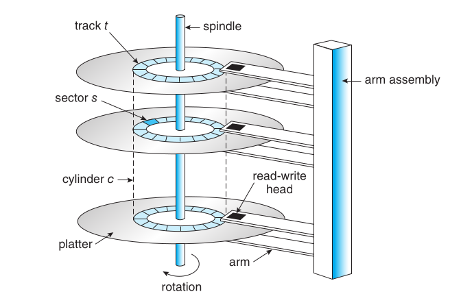
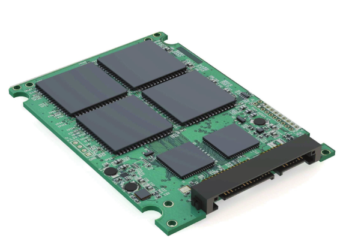

Now that my Proxmox VE is up and running, I plan to run TrueNAS as a KVM virtual machine and pass through my SSDs to create a ZFS storage pool inside it.

I currently have four SSDs: one 512 GB and three 256 GB. I intend to add a quad M.2 PCIe adapter by enabling PCIe bifurcation (a feature that allows a single physical PCIe slot to be logically divided into multiple smaller independent PCIe links, x16 -> four x4).

With a total of 4 SATA SSDs and 4 NVMe SSDs available, I want to implement ZFS in the most efficient way possible.

I know ZFS has built-in caching features to speed up reads, but before setting it up, I'd like to understand ZFS properly. And even before that — what exactly is a file system?

Let's start by exploring file systems in general, then move on to ZFS, and eventually cover creating our storage pool and setting up caching.

Even before starting with the file system, lets get an overview of the mass storage structure.

## Mass Storage Structure
### Hard Disk Drives:



In Hard disk - disk drive motor spins which is measured in rotation per minute (RPM). It determines the transfer rate.  Present HDD have an average 7200 RPM. And the present transfer rate is 250-300 MB/s. Some company uses dual or multi actuators to get sequential read  and write speed up to 554 MB/s. Unlike the picture above, the dual actuator means separate read and write head.

### Nonvolatile Memory Devices


| Generation / Standard   | Interface          | Max Theoretical Speed | Real-world Sequential Speed | Notes / Examples                              |
|-------------------------|--------------------|------------------------|-----------------------------|-----------------------------------------------|
| SATA I                  | SATA 1.5 Gb/s      | ~150 MB/s             | ~100–140 MB/s              | Very old (pre-2007), rarely used today        |
| SATA II                 | SATA 3 Gb/s        | ~300 MB/s             | ~250–280 MB/s              | Obsolete for SSDs, backward compatible        |
| SATA III (current)      | SATA 6 Gb/s        | ~600 MB/s             | ~500–560 MB/s              | Dominant standard since ~2010<br>e.g., Samsung 870 EVO, Crucial MX500, WD Blue 3D NAND |


| Generation     | Interface       | Max Sequential Speed     | Notes / Examples                          |
|----------------|-----------------|---------------------------|-------------------------------------------|
| NVMe Gen 3     | PCIe 3.0 x4     | ~3,500 MB/s              | Common in 2018–2022 drives                |
| NVMe Gen 4     | PCIe 4.0 x4     | ~7,500 MB/s              | e.g. Samsung 990 Pro, WD Black SN850X     |
| NVMe Gen 5     | PCIe 5.0 x4     | ~14,900 MB/s             | High-end consumer drives since ~2024–2025 |
| NVMe Gen 6     | PCIe 6.0 x4     | ~28,000 – 30,000 MB/s    | Enterprise-only (as of late 2025)         |

<!-- markdownlint-capture -->
<!-- markdownlint-disable -->
> Note:
{: .prompt-info }
<!-- markdownlint-restore -->

Although both uses NAND flash memory, the differences in performance is due to interface and bandwidth. PCIe is like a multi-lane highway whereas SATA is like driving on a narrow road. Also, SATA is based on AHCI protocol (Advanced Host Controller Interface) which was originally designed for HDD. 


## Storage Abstraction Layers

| Level          | Name / Concept                      | Typical Size (2024–2025)    | Managed by                                      | What the OS sees / uses it for                        | Key purpose                                          |
|----------------|-------------------------------------|-----------------------------|-------------------------------------------------|-------------------------------------------------------|------------------------------------------------------|
| 1              | Physical Sector                    | 512 bytes – 4 KiB           | SSD / HDD firmware                              | Raw hardware address                                  | Smallest unit the drive itself can read/write       |
| 2              | Logical Block / LBA                | Usually 512B or 4KiB        | OS block layer + driver                         | `/dev/sda`, `\\.\PhysicalDrive0`                      | Uniform "blocks" OS talks to                        |
| 3              | Partition                          | Many GiB – few TiB          | Partition table (GPT/MBR)                       | `/dev/sda1`, `C:`, `D:`                               | Divide disk into independent areas                  |
| 4 (optional)   | RAID / Storage Spaces / mdadm      | Very flexible               | Hardware RAID card / OS software RAID           | One big "virtual disk"                                | Performance + redundancy across multiple drives     |
| 5 (optional)   | Logical Volume (LVM / LDM)         | Very flexible               | LVM (Linux), Storage Spaces/Dynamic Disk (Windows) | `/dev/mapper/vg-lv`, bigger & resizable "disk"     | Easy resizing, pooling many disks                   |
| 6              | File System                        | —                           | ext4 / NTFS / APFS / XFS / Btrfs / ReFS         | Formatted volume ready for files                      | Organizes files & directories                       |
| 7              | Allocation Unit / Cluster          | 1–64 KiB (most often 4 KiB) | File system itself                              | Smallest unit file system allocates                   | Efficiency trade-off: speed vs. wasted space        |

To sum up the file system abstraction:
* Level 5 – You:          "I want to save my homework"
* Level 4 – Programs:     "Please OS, save this as homework.docx"
* Level 3 – File system:  "Okay, I'll use these clusters and remember the name"
* Level 2 – Disk driver:  "Here are some clean 4KB blocks to write into"
* Level 1 – Real disk:    "Fine… writing electricity/magnetic stuff now…"

### Cluster / Allocation Unit

On the above table, `Allocation unit/Cluster` (Row 7) is introduced by `File system` (Row 6). Think of cluster as the smallest piece of disk space that the file system is willing to give to a file. 

> Lets use a simple real-life analogy.  Imagine you have a huge warehouse with shelves. Each shelf can hold exactly 4 boxes and you cannot rent half a shelf. When you want to store something, you must take a whole shelf (even if you only have 1 small box). That shelf is called cluster (or allocation unit) and the size of one shelf is called cluster size (most often 4KB today).

### Cluster Size
| File System       | Most common cluster size (block size) | Wasted space for tiny files | Typical use-case                                      |
|-------------------|---------------------------------------|-----------------------------|-------------------------------------------------------|
| NTFS (Windows)    | 4 KB                                  | medium                      | Normal computers, external drives, enterprise servers |
| exFAT             | 32 KB – 128 KB                        | **very high**               | USB flash drives, SD cards, cross-platform large files|
| ext4 (Linux)      | 4 KB                                  | medium                      | Linux servers & desktops (very common default)        |
| APFS (macOS)      | 4 KB                                  | medium                      | Modern Macs (since 2017)                              |
| FAT32             | 4 KB – 32 KB                          | high                        | Old USB sticks, very small drives, legacy devices     |
| **ZFS**           | **Variable** (default 128 KB)         | **high** for tiny files     | NAS, servers, data centers, backups, large storage pools (FreeBSD, TrueNAS, Linux, macOS via OpenZFS) |

### Where does ZFS fit in the storage abstraction layers?
ZFS combines several layers that are usually separate in traditional stack.
> Normal Stack: Physical disk → Partitions → (optional RAID/LVM) → File system (ext4/NTFS) → Files & folders

```sh
Physical disks (many) 
      ↓
ZFS Pool (vdevs → mirrors/RAID-Z/RAID-Z2/etc.)   # ZFS does the RAID part itself
      ↓
ZFS Datasets / Volumes / Snapshots / Clones      # ZFS acts as both "file system" and "logical volume manager"
      ↓
Files & Folders
```
ZFS uses the term recordsize (not exactly the same as cluster/allocation unit). The default recordsize is 128KB and you can set it per dataset from 512 B to 16 MB. 

## Files and Directories
Now that we have the mental model of storage abstraction layers. Lets go one level deep to better understand the file system. 

Before we do that, a little bit of housekeeping- 

1. `What is offset?`- it simply means how far from the beginning.

      ```sh
      file content: [byte 0] [byte 1] [byte 2] [byte 3] [byte 4] [byte5]
                        H         E      L        L         L       O
      # Offset 0 = start of the file (first byte: 'H')
      # Offset 4 = 4 bytes from the beginning (fourth byte: 'L)
      ```
2. `Hard and Soft Link`:
    
      ```sh
      # Create hard link
      ln original.txt backup.txt

      # Now both names point to same data
      # If you delete original.txt → backup.txt STILL WORKS
      # rm original.txt
      # cat backup.txt   ← still shows content
      ```
      ```sh
      # Create symbolic link
      ln -s /home/user/documents/real_file.txt ~/Desktop/shortcut.txt

      # If you move or delete real_file.txt → shortcut becomes broken
      # ls -l shows:
      # lrwxrwxrwx 1 user user  ... shortcut.txt -> /home/user/documents/real_file.txt
      ```
3. `Bitmap`:
      A simple map made of 0s and 1s that shows whether something is free or used
      ```sh
      Disk has 1,000,000 blocks (very small example)

      Bitmap = 000101100011... (1,000,000 bits long = only ~125 KB of space!)

      Wherever you see a 0 → that block is free → you can use it
      Wherever you see a 1 → someone already uses that block
      ```
4. `Copy-On-Write`: 
      Don't copy data right now when someone asks for a copy.
      Just pretend you copied it.
      Only make a real copy later — at the exact moment someone tries to change their version.

Now back to the topic.
`How do we go from a file name and offset to a block number?`
> A simple answer is that file systems implement a dictionary that maps keys (file name and offset) to values (block number on a device)


Based on the file system type (NTFS, ext4, XFS, ZFS), it organizes a dictionary as linked list, tree, hash map etc. This is well explained in book [Operating Systems Principles & Practice](https://www.kea.nu/files/textbooks/ospp/osppv4.pdf) in chapter 13- Files and Directories.

| Row                          | What it really means                                       | FAT (very old, simple, like old USB sticks)              | FFS (Berkeley Fast File System – classic Unix from 1980s)          | NTFS (modern Windows default)                          | ZFS (very modern, used in big servers & data storage)          |
|------------------------------|------------------------------------------------------------------------------|----------------------------------------------------------|---------------------------------------------------------------------|--------------------------------------------------------|-----------------------------------------------------------------|
| Index structure              | How does the file system remember "where are the pieces of this file on disk"? (like a table of contents) | Very simple linked list (each piece points to the next)  | Fixed tree, a bit uneven/asymmetric (multi-level index)            | Dynamic tree (can grow/shrink smartly)                 | Very smart dynamic tree with Copy-On-Write (COW)                |
| Index structure granularity  | What size chunks does it use when pointing to file data?                     | One block at a time                                      | One block at a time                                                 | Bigger pieces called extents (good for large files)    | One block at a time                                             |
| Free space management        | How does it keep track of which parts of the disk are still empty and can be used? | Old-school table (FAT array) that marks every block      | Fixed bitmap (simple on/off map, doesn't change size)               | Bitmap, but stored inside a special file (more flexible) | Very clever log-structured space map                            |
| Locality heuristics          | Tricks the file system uses so that related data stays physically close together on disk (faster reading) | Needs separate defragmenter tool                         | Puts related things in block groups + reserves space                | Tries to find the best fit place + defrag when needed  | "Write anywhere" + still tries to keep groups together          |

The table above is just a quick summary of how different types of file systems work. Under the hood, a tremendous amount is happening, and I dared to dive deep into the underlying structures. My head is still spinning from it, but at the end of this rabbit hole, I finally saw the light—or perhaps I even found enlightenment, like Buddha did.

Now when I look at these file systems, I can see right through them. I understand how they actually work, where they fall short, the limitations of older file systems, and how the newer ones were specifically designed to overcome the shortcomings of their predecessors.

Here, I’m simply going to list diagrams of the file system structures. That way, if I ever need to revisit this topic in the future, I can quickly refresh my memory.

### File Allocation Table (FAT)


### Unix Fast File System (FFS)


### Microsoft New Technology File System (NTFS)


### Zettabyte File System (ZFS)- CoW based


The above images are taken from book [Operating Systems Principles & Practice](https://www.kea.nu/files/textbooks/ospp/osppv4.pdf)


## RAID

> A stich in time saves nine.

Redundant Array of Inexpensive/Independent Disks
* RAID 0 – striping
* RAID 1 – mirroring
* RAID 5 – striping with parity
* RAID 6 – striping with double parity
* RAID 10 – combining mirroring and striping

The average time from when a disk fails until it has been replaced and
rewritten is called the `mean time to repair (MTTR)`.

Here is a good read about [RAID](https://www.prepressure.com/library/technology/raid).

1. `RAID 0` offers get performance but is not fault tolerant.

      

2. `RAID 1` : Software RAID 1 solutions do not always allow a hot swap of a failed drive. That means the failed drive can only be replaced after powering down the computer it is attached to. For servers that are used simultaneously by many people, this may not be acceptable. Such systems typically use hardware controllers that do support hot swapping.

      

3. `RAID 5`: Read data transactions are very fast while write data transactions are somewhat slower (due to the parity that has to be calculated). 
   
      

4. `RAID 6`: RAID 6 is like RAID 5, but the parity data are written to two drives. That means it requires at least 4 drives and can withstand 2 drives dying simultaneously. 
   
      

5. `RAID 10`: This is a nested or hybrid RAID configuration. It provides security by mirroring all data on secondary drives while using striping across each set of drives to speed up data transfers.

      

## Whats Next? 
Lets go back to our Proxmox server and spin off a TrueNas VM and create ZFS pool.


## Reference
<https://www.cs.cornell.edu/courses/cs4410/2019sp/schedule/slides/Lecture22.pdf>

<https://www.kea.nu/files/textbooks/ospp/osppv4.pdf>

<https://cs.uml.edu/~bill/cs308/ZFS_File_Sys.pdf>

<https://www.prepressure.com/library/technology/raid>


