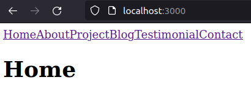
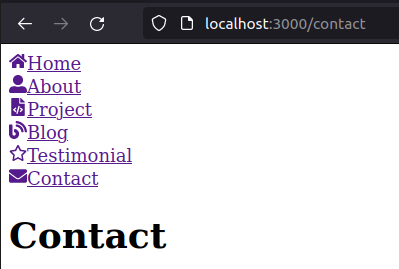
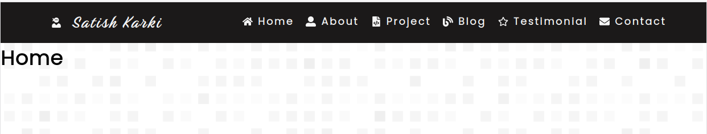
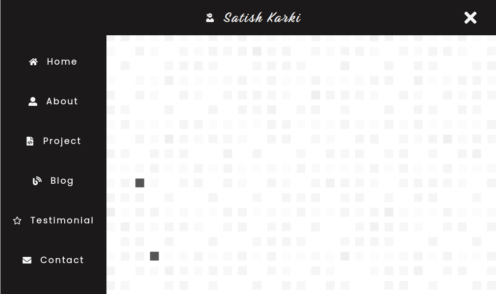
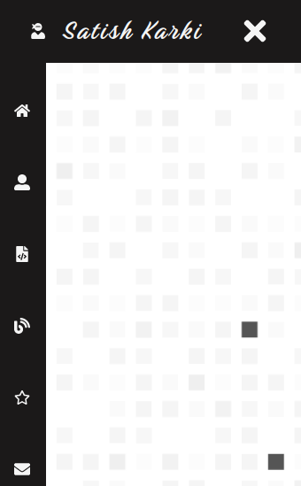

# Creating my portfolio 

***Part 1***

## 1. Setting up react app

```bash
npx create-react-app my-app
cd my-app
npm start
```

- npx is a package runner tool that comes with npm 5.2+

***

## 2. Setting Up Navigation Link with React Router

**Reference:** [React Router, freeCodeCamp](https://www.freecodecamp.org/news/react-router-in-5-minutes/)

First let's set up different pages. Create a folder called `pages` inside `src`. Don't create the folder outside the `src` , it  will throw error. Create six pages (components) as follows:

```bash
#./pages/src
Home.js
About.js
Project.js
Blog.js
Testimonial.js
Contact.js
```

```jsx
import React from "react";
function Home() {
  return (
    <div>
      <h1 className="home">Home</h1>
    </div>
  );
}
export default Home;
```

```jsx
//index.js
import React from 'react';
import ReactDOM from 'react-dom';
import App from './App';

ReactDOM.render( 
        <App />,
        document.getElementById('root')
);
```

```jsx
//App.js
import React from 'react';
import { BrowserRouter, Route, Switch } from "react-router-dom";
import Home from './pages/Home'
import About from './pages/About';
import Blog from './pages/Blog';
import Contact from './pages/Contact';
import Project from './pages/Project';
import Testimonial from './pages/Testimonial';
import Error from './pages/Error';
import NavBar from './pages/NavBar';

function App(){
    return(
        <main>
        <BrowserRouter>
            <NavBar/>
            <Switch>
                <Route exact path="/" component={Home}/>
                <Route path="/about" component={About}/>
                <Route path="/project" component={Project}/>
                <Route path="/blog" component={Blog}/>
                <Route path="/testimonial" component={Testimonial}/>
                <Route path="/contact" component={Contact}/>
                <Route  component={Error}/>
            </Switch>
        </BrowserRouter>    
        </main>
    )
}
export default App;
```

```jsx
//NavBar.js
import React from "react";
import { Link } from "react-router-dom";

function NavBar(){
    return(
        <div>
            <Link to ="/">Home</Link>
            <Link to ="/about">About</Link>
            <Link to ="/project">Project</Link>
            <Link to ="/blog">Blog</Link>
            <Link to ="/testimonial">Testimonial</Link>
            <Link to ="/contact">Contact</Link>
        </div>
    );
};
export default NavBar;
```

**Result**



***

**Question**: What is the difference between exact path and path?

```jsx
<Route exact path="/" component={Home} />

<Route path="/" component={Home} />

//The exact param disables the partial matching for a route and makes sure that it only returns the route if the path is an EXACT match to the current url.
```

[Learn More...](https://stackoverflow.com/questions/49162311/react-difference-between-route-exact-path-and-route-path)

***

## 3. SVG Icons in React with React icons and Font Awesome

Reference: [How to Use SVG Icons in React, freeCodeCamp](https://www.freecodecamp.org/news/how-to-use-svg-icons-in-react-with-react-icons-and-font-awesome/)

Explore [React Icon](https://react-icons.github.io/react-icons)

Create Free [SVG Background](https://www.svgbackgrounds.com/) 

```bash
npm install react-icons --save
```

```JSx
// import Font Awesome
import { IconName } from "react-icons/fa";
```

```jsx
//NavItem.js
import React from "react";
import {FaHome, FaUserAlt, FaFileCode,FaBlog,FaRegStar,FaEnvelope} from "react-icons/fa";
export const navlinks=[
    {
        id:1,
        name:"Home",
        path:"/",
        icon:<FaHome/>
    },
    {
        id:2,
        name:"About",
        path:"/about",
        icon:<FaUserAlt/>
    },
    {
        id:3,
        name:"Project",
        path:"/project",
        icon:<FaFileCode/>
    },
    {
        id:4,
        name:"Blog",
        path:"/blog",
        icon:<FaBlog/>
    },
    {
        id:5,
        name:"Testimonial",
        path:"/testimonial",
        icon:<FaRegStar/>
    },
    {
        id:6,
        name:"Contact",
        path:"/contact",
        icon:<FaEnvelope/>
    }
];
```

***

## 4. React Map Function `map()`

**Reference: [List and Keys, reactjs.org](https://reactjs.org/docs/lists-and-keys.html)**

```jsx
//Example
const numbers = [1, 2, 3, 4, 5];
const doubled = numbers.map((number) => number * 2);console.log(doubled);
```

Now use the `map()` function to create create a list of icon and name in NavBar.js

```jsx
import React from "react";
import { Link } from "react-router-dom";
import {navlinks} from "./NavItem";


function NavBar(){
    const NavMenu=navlinks.map((navlink)=>
    <li key={navlink.id}>
        <Link to={navlink.path}>
        {navlink.icon}
        <span>{navlink.name}</span>
        </Link>
    </li>
    );
    return(
        <div>{NavMenu}</div>
    );
}
export default NavBar;
```

**Result:**



***

## 5. React  Hooks

**References:**

- [using the State Hook, reactjs.org](https://reactjs.org/docs/hooks-state.html)
- [How the useEffect Hook Works, Dave Ceddia](https://daveceddia.com/useeffect-hook-examples/)

Once you styled the `NavBar`, next step will be to make it responsive. We can use `useState()` and `useEffect()` hooks to achieve the responsiveness.

```jsx
const [mobileView,setmobileView]=useState(false);
```

```jsx
// useEffect(()=>{},[])

const [value, setValue] = useState('initial');

useEffect(() => {
  // This effect uses the `value` variable,
  // so it "depends on" `value`.
  console.log(value);
}, [value])  // pass `value` as a dependency


```

```jsx
// In NavBar.js
import React,{useEffect, useState} from "react";
import { Link } from "react-router-dom";
import {navlinks} from "./NavItem";
import "../style/NavBar.css"
import {FaUserNinja,FaBars,FaTimes} from "react-icons/fa";

function NavBar(){
    const[mobileView, setmobileView]=useState(false);
    const[sideBar,setsideBar]=useState(false);
   
    useEffect(()=>{
        if(window.innerWidth<1100){
            setmobileView(true);
        }
    },[]);
    useEffect(()=>{
        const handleResize=()=>{
            if(window.innerWidth<1100){
                setmobileView(true);
            }
            else{
                setmobileView(false);
                setsideBar(false);
            }
        }
        window.addEventListener("resize",handleResize);
        return()=>{
            window.removeEventListener("resize",handleResize);
        }
    },[])

    const NavMenu=navlinks.map((navlink)=>
        
          <li className="nav-item" key={navlink.id}>
            <Link to={navlink.path} >
                {navlink.icon}
                <span >{navlink.name}</span>
            </Link>
            </li>
    );

    const BrandName=(
        <div className="BrandDiv">
            <Link to="/" className="navlogo">
                <FaUserNinja/>
                <span className="logo-name">Satish Karki</span>
            </Link>
        </div>   
    );
  
    const SideBar=(
        <div className="sidebar-toggle">
            {!sideBar?(
                <FaBars className="sidebar-logo" onClick={()=>setsideBar(!sideBar)}/>
            ):
            (<FaTimes className="sidebar-logo" onClick={()=>setsideBar(!sideBar)}/>)}

        </div>  
    );
    const SideBarMenu=navlinks.map((navlink)=>
        
    <li className="side-nav-item" key={navlink.id}>
      <Link to={navlink.path} >
          {navlink.icon}
          <span >{navlink.name}</span>
      </Link>
      </li>
);

    return(
        <div>
             <div className="Header">
                {BrandName}
                {!mobileView && <div className="nav-items">
                {NavMenu}
                </div>}
                {mobileView && SideBar}
            </div>
            <div className={sideBar?"SideDiv active":"SideDiv"}>
                {SideBarMenu}
            </div>
        </div>   
    );
}
export default NavBar;
```


*****

## Result







